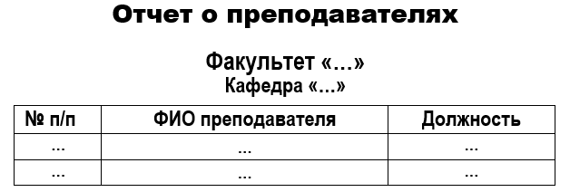
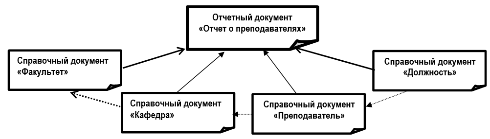

# Лабораторная работа №1 #

## Тема ##

Создание эталонов документов для АС

## Цель работы ##

Приобрести навыки создания эталонов документов для использования в автоматизированной системе и проверки ее функционирования

## Теоретический материал ##

Эталон документа – это образец документа, отражающий его структуру и заполнение его данными. Эталоны документов используются для проверки структур БД после ее создания, проверки функций АС и ее испытания, а также для написаний руководств пользователя. В таблице представлен пример эталона документа «Экзаменационная ведомость».

*Экзаменационная ведомость №1
Факультет «ФЭИС» Группа «АС-11» Дисциплина «ОА»
ФИО преподавателя «Багатель О.В.»  Дата «11.01.2015»*

| №п/п| ФИО студента| Номер зачетной книжки|Оценка|
|:----------:|:----------:|:-------------:|:-------------:|
| 1|  Абрамчук Андрей Васильевич| 955729|восемь |
| 2|  Бабич Илья Владимирович| 855701|семь |
| ...|  ...| ...|... |

**Таблица 1 $-$ Пример эталона оперативного документа «Экзаменационная ведомость»**

## Процесс разработки эталонного документа ##

Разработка эталона документа включает в себя следующие этапы:

+ Проектирование макета документа
+ Анализ взаимосвязей документа с иными документами, на основании которых от заполняется
+ Формирование модели документа – описание иерархии данных документа 
+ Определение количества записей для заполнения документа
+ Формирование эталона документа с внесенными записями

## Создание эталона отчетного документа «Отчет о преподавателях» ##

Создание эталона отчетного документа «Отчет о преподавателях» будет производиться согласно приведенной выше последовательности действий.

+ Проектирование макета документа

**Рис. 1 $-$ Макет отчетного документа «Отчет о преподавателях»**

+ Анализ взаимосвязей документа с иными документами, на основании которых он заполняется

**Рис. 2 $-$ Взаимосвязь документа «Отчет о преподавателях с иными документами»**

+ Формирование модели документа

Модель документа представляет взаимосвязь данных представляется через структуру

**Родительский элемент (Потомок 1 (…), Потомок 2 …),**

где внутри скобок указываются через запятую все подчиненные элементы для данного элемента.
Модель отчетного документа «Отчет о преподавателях» может иметь следующую структуру

**Отчет о преподавателях (Список факультетов (Название факультета, Список кафедр (Название кафедры, Список преподавателей (Номер п/п, ФИО Преподавателя, Должность))))**

+ Определение количества записей для заполнения документа
При разработке эталона документа необходимо, чтобы в каждом из списков документа было как минимум по две неповторяющиеся записи. Из анализа взаимосвязи документа с иными документами (п.2) следует:

+ В справочном документе «Факультет» – две записи.
+ В справочном документе «Кафедра» - четыре записи.
+ В справочном документе «Преподаватель» – восемь записей.
+ В справочном документе «Должность» – четыре записи.
+ Формирование эталона документа с внесенными записями

Для формирования эталона отчетного документа «Отчет о преподавателях» необходимо сформировать эталоны справочных документов «Факультет», «Кафедра», «Преподаватель», «Должность».

**СПРАВОЧНИК «ФАКУЛЬТЕТ»**

|№п/п | Полное наименование факультета |Сокращенное обозначение факультета  |
|:----------:|:----------:|:-------------:|
| 1| Факультет электронно-информационных систем | ФЭИС|
| 2| Факультет заочного обучения| ФЭО|

**Таблица 2 – Эталон для справочного документа «Факультет»**

**СПРАВОЧНИК «ПРЕПОДАВАТЕЛЬ»**

|№п/п | ФИО преподавателя |Должность  |  Название кафедры|
|:----------:|:----------:|:-------------:|:-------------:|
| 1| Богатель Ольга Викторовна  | Доцент| ИИТ|
| 2| Веремейчук Александр Владимирович| Доцент| ИИТ|
| 3| Вовченко Александр Сергеевич | Ассистент| ВМиС|
| 4| Давидюк Наталия Ивановна  | Старший преподаватель| ВМиС|
| 5| Ильюшенко Сергей Валерьевич  |Профессор| ММТ|
| 6| Ковальчук Кирилл Иванович  |Доцент| ММТ|
| 7|Ковч Ольга Александровна   |Ассистент| АСУ|
| 8| Колос Юрий Олегович   |Доцент| ММТ|

**Таблица 3 $-$ Эталон для справочного документа «Преподаватель»**

**СПРАВОЧНИК «КАФЕДРА»**

|№п/п | Сокращенное обозначение факультета   |Название кафедры  |
|:----------:|:----------:|:-------------:|
| 1| ФЭИС  | ИИТ|
| 2| ФЭИС|  ВМиС|
| 3| ФЭО | Ассистент| ММТ|
| 4| ФЭО  | АСУ|

**Таблица 4 $-$ Эталон для справочного документа «Кафедра»**

**СПРАВОЧНИК «ДОЛЖНОСТЬ»**

|№п/п | Название  должности |
|:----------:|:----------:|
| 1| Профессор |
| 2| Доцент|  
| 3| Старший преподаватель|
| 4| Ассистент|

**Таблица 5 $-$ Эталон для справочного документа «Должность»**

**ОТЧЕТ О ПРЕПОДАВАТЕЛЯХ**

**Факультет «Факультет электронно-информационных систем»**

**Кафедра «ИИТ»**  

|№п/п | ФИО преподавателя   |Должность |
|:----------:|:----------:|:-------------:|
| 1| Богатель Ольга Викторовна  | Доцент|
| 2| Веремейчук Александр Владимирович|  ВМиС|

**Кафедра «ВМиС»**

|№п/п | ФИО преподавателя   |Должность |
|:----------:|:----------:|:-------------:|
| 1| Вовченко Александр Сергеевич   | Ассистент|
| 2| Давидюк Наталия Ивановна |  Старший преподаватель|

**Факультет «Факультет заочного обучения»** 

**Кафедра «ММТ»**

|№п/п | ФИО преподавателя   |Должность |
|:----------:|:----------:|:-------------:|
| 1| Ильюшенко Сергей Валерьевич    | Профессор|
| 2| Ковальчук Кирилл Иванович |  Доцент|

**Кафедра «АСУ»**

|№п/п | ФИО преподавателя   |Должность |
|:----------:|:----------:|:-------------:|
| 1| Ковч Ольга Александровна    | Ассистент|
| 2|Колос Юрий Олегович  |  Доцент|

**Таблица 6 $–$ Эталон для отчетного документа «Отчета о преподавателях»**

## Ход работы ##

1. Разработать эталоны для справочных, оперативных и отчетных документов, указанных в **Приложении 1** бланка задания курсовой работы.
2. Документировать результаты выполнения лабораторной работы

### Контрольные вопросы ###

1. Что такое эталон документа и в каких целях он применяется?
2. Из каких этапов состоит процесс разработки эталона документа?
3. Сколько минимально неодинаковых записей должен иметь каждый список эталона документа?