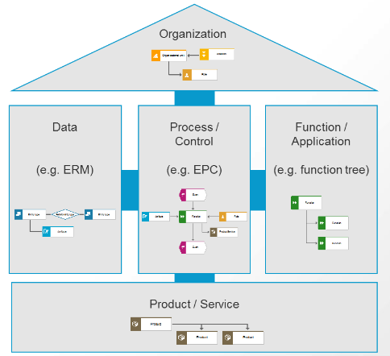
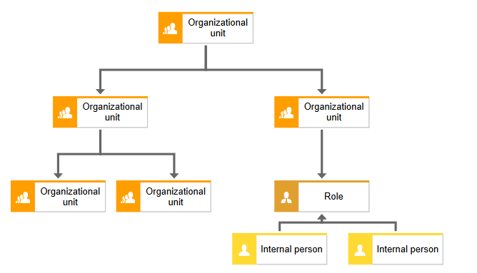

# Лабораторная работа №2 #

## Тема ##

Обследование объекта автоматизации: организационная структура.

## Цель работы ##

Описать объект автоматизации через его организационную структуру.

## Теоретический материал ##

Моделирование организационной структуры компании $-$ стартовая точка в создании топологии компьютерной сети и подсистем АСУ, т.к. определяет участников бизнес-процесса, а также пользователей проектируемой информационной системы.

Организационная структура (оргструктура) $-$ совокупность подразделений организации и их взаимосвязей, в рамках которой между подразделениями распределяются функциональные задачи, определяются полномочия и ответственность руководителей и должностных лиц.

Оргструктура предприятия устанавливается исходя из объема и содержания задач, решаемых предприятием, направленности и интенсивности, сложившихся на предприятии информационных и документационных потоков и с учетом его организационных и материальных возможностей.

Очень часто оргструктуру представляют через органиграмму (рис.1). Органиграмма $-$ это схема или таблица, служащая для графического изображения организационной структуры управления.

**Рис. 1 – Органиграмма БрГТУ**

ARIS (акроним от англ. Architecture of Integrated Information Systems) $-$ методология и тиражируемый программный продукт для моделирования бизнес-процессов организаций.

Любая организация в методологии ARIS рассматривается с пяти точек зрения: организационной, функциональной, обрабатываемых данных, структуры бизнес-процессов, продуктов и услуг (рис.2).

**Рис. 2 – Дом ARIS**

Организационную структуру методология ARIS представляет через нотацию Organizational chart (рис. 3).

**Рис. 3 – Organizational chart**

В Таблице 1 представлены основные элементы нотации Organizational chart.

|  |  Элемент организационной иерархии. Обычно это отдел или департамент.|
|----------|:-------------|
|  |   Роль или должность. Обозначает набора компетенций и задач, решаемых человеком наделенным данной ролью или должностью.|  
|   | Конкретный человек |  
|   | Физическое местоположение отдела, компании и т.д. | 

**Таблица 1 – Элементы нотации Organizational chart**

## Ход работы ##

1. Используя нотацию ARIS Organizational Chart, спроектировать организационную структуру объекта автоматизации.

2. Построить таблицу «Каталог организационных единиц».

| № п/п | Наименование организационной единицы | Расшифровка|
|----------|----------|-------------|
| 1 | Магазин | Отделение|
| 2 | Заведующий | Руководитель отделения|

3. Результаты представить в виде отчета. Подготовить ответы на контрольные вопросы.

## Контрольные вопросы ##

1. Что такое организационная структура предприятия?
2. Как представляется организационная структура предприятия?
3. Какая нотация используется в методологии ARIS для представления организационной структуры предприятия?
4. Перечислите элементы нотации Organizational Chart и их назначение.

## Рекомендуемый информационный источник ##

[www.ariscommunity.com/organizational-chart](https://www.ariscommunity.com/organizational-chart)