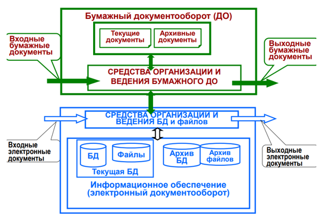
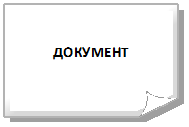
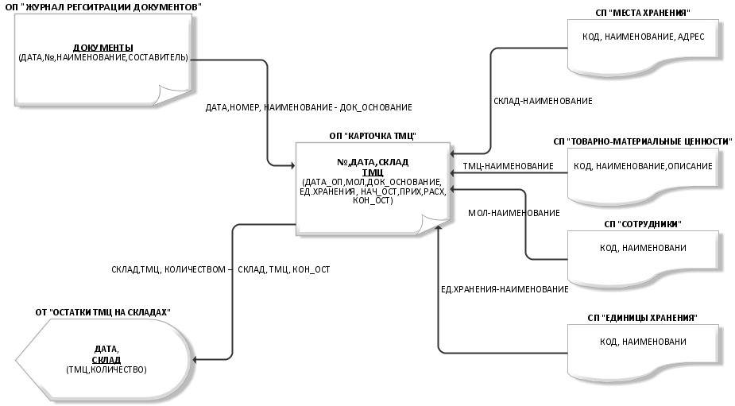
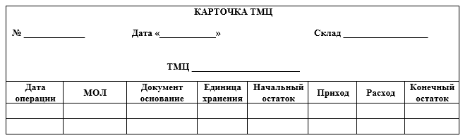
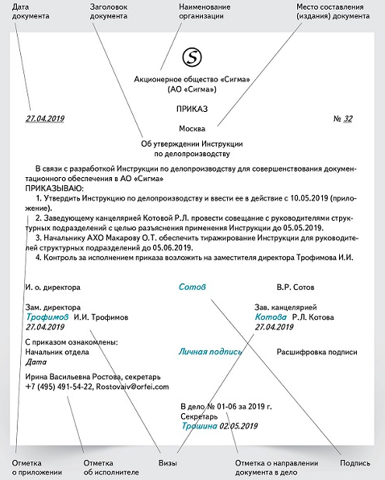
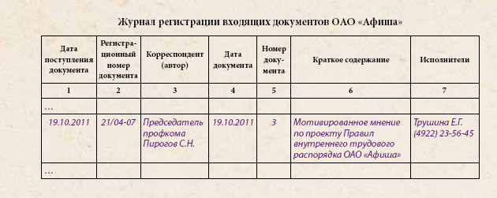
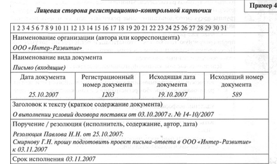
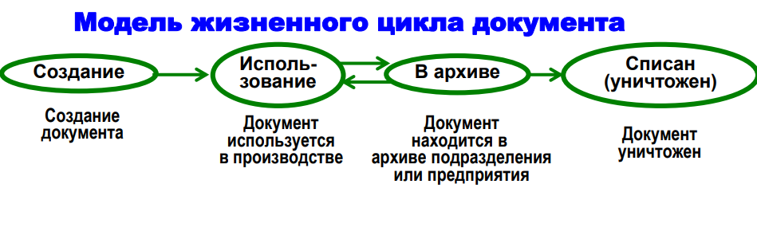
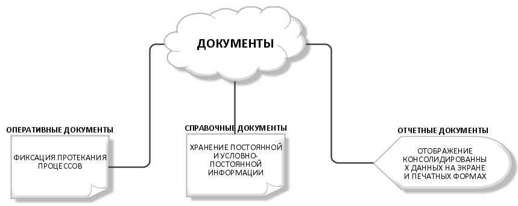
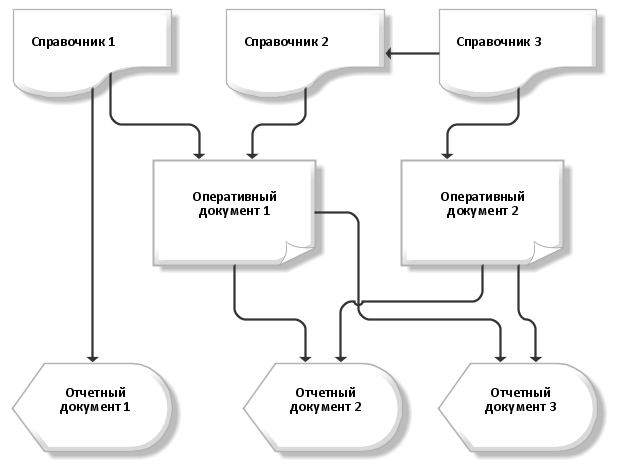

# Лабораторная работа №3 #

## Тема ##

Обследование объекта автоматизации: построение информационной модели.

## Цель работы ##

Построение информационной модели объекта автоматизации.

## Теоретический материал ##

Информационная структура объекта автоматизации $-$ это совокупность документов, архивов, правил и норм ведения документооборота, используемые на объекте автоматизации. В ИС ОА входят так же средства автоматизации (автоматизированные и информационные системы, базы и банки данных, электронные архивы и т.д.), используемые объектом. Все элементы ИC ОА относятся либо к внемашинному (бумажному) либо внутримашинному (цифровому) обеспечению (Рис. 1).

**Рис. 1 – Схема информационной структуры АС**

## Информационная модель объекта автоматизации ##

Под информационной моделью объекта понимается набор некоторых параметров, которые содержа необходимую информацию об объекте, системе объектов, процессе или явлении. Целью создания информационной модели объекта является обработка данных об объекте с учетом его внутренних и внешних связей. Для того чтобы такую обработку можно было автоматизировать, для рассматриваемой модели составляют формализованное описание, доступное компьютерной обработке.

ИМ можно описывать различными способами: табличным, графическим, текстовым и т.д. В методологии ARIS информационную модель можно выполнить с помощью нотации General diagram, элементы которой представлены в Таблице 1.

**Таблица 1 $-$ Элементы ARIS General diagram для выполнения ИМ**

|ЭЛЕМЕНТ | НОТАЦИЯ |ЗНАЧЕНИЕ  |
|:----------:|:----------:|:-------------:|
| |General diagram| Данные, хранящиеся на запоминающем устройстве (БД, файл и т.д.)|
| | General diagram| Данные на носителе (носитель не определен)|
| | General diagram| Данные на носителе (носитель не определен)|
| | General diagram| Совокупность IT- ресурсов|
| | General diagram|Хранимые данные (носитель не определен)|
| | General diagram| Данные, отраженные на дисплее|

Основным носителями данных и информации в организациях и компаниях являются документы, являющиеся обязательными элементами ИМ. Поэтому ИМ можно представлять через информационные связи между документами (Рис. 2).

**Рис. 2 -  Схема информационных связей документов**

*Некоторые документы, представленные на схеме, имеют табличную часть, состоящую из некоторого количества строк одинаковой структуры. В этом случае наименование табличной части выделяется «жирным» шрифтом и подчеркивается, а структура строки перечисляется сразу после наименования в скобках.
Также документы, участвующие в ИМ, описываются через словарь данных, в котором указываются все атрибуты документа, их назначение, типы данных и источники данных (Таблица 2).

**Таблица 2 $-$ Словарь данных документа «Карточка ТМЦ»**

| АТРИБУТ| НАЗНАЧЕНИЕ| ТИП ДАННЫХ|ИСТОЧНИК ДАННЫХ|
|:----------:|:----------:|:-------------:|:-------------:|
| **1** |  **2**          |**3**|**4** |
| №     | Номер документа | Число|    -      |
|ДАТА   | Дата документа  | Дата| -|
|СКЛАД  | Место хранения ТМЦ |Строка |СП «Места хранения» |
|ТМЦ    | Наименование ТМЦ | Строка|СП «Товарно-материальные ценности» |
|ДАТА_ОП| Дата операции |Дата | |
|МОЛ | Ответственный | Строка| СП «Сотрудники»|
| **1** |  **2**| **3**|**4** |
|ДОК_ОСНОВАНИЕ | Документ $-$ основание | Строка| ОП «Журнал регистрации документов»|
|ЕД_ХРАНЕНИЯ   |  Единица хранения| Строка| СП «Единицы хранения»|
| НАЧ_ОСТ      | Начальный остаток |Число | |
| ПРИХОД       |  Пришло| Число| |
|РАСХОД        |  Ушло| Число| |
| КОН_ОСТ      | Конечный остаток | Число| |

Каждый документ в ИМ представляется через макет данных $-$ графическую форму документа (Рис. 3).

**Рис. 3 $-$ Макет документа «Карточка ТМЦ»**

## Документ и его структура ##

Документ $-$ это информационное сообщение в бумажной, звуковой или электронной форме, оформленной по определенным правилам, заверенное в установленном порядке и имеющем юридическую силу. Документ должен быть оформлен по заданным правила и иметь определенную структуру, элементарной единицей которой является реквизит документа. Отсутствующий обязательный реквизит лишает документ юридической значимости и делает ничтожной любую сделку и недостоверной любую информацию. То есть, документ может подтверждать правовые обязательства или деловую деятельность компании только в случае, если соблюден установленный порядок его оформления.

Реквизиты документа $-$ это перечень обязательных сведений, которые должны быть представлены в зависимости от вида документа. При этом важен не только состав и содержание того или иного реквизита, но и то, как он оформлен, и где расположен.

Перечень реквизитов у всех документов свой, в то же время можно выделить общую часть реквизитов, которые встречаются в документах достаточно часто.

**Номер документа** $-$ реквизит документа однозначно позволяющей сослаться на документ. Структура номера определяется в каждой организации самостоятельно.

**Дата документа** $-$ реквизит, указывающий на дату его подписания, утверждения или дату событий, зафиксированного в документе.

**Наименование документа** $-$ реквизит являющийс одним из важнейших, поскольку позволяет судить о назначении документа, определяет состав реквизитов и структуру текста. Наименование документов проставляется на всех документах.

**Наименование организации** $-$ составителя $-$ реквизит называет автора документа, которым может быть организация, структурное подразделение, должностное или физическое лицо.

**Визы согласования.** Указываются данные согласующих документ сторон.

**Заголовок к тексту.** Реквизит является обязательным для всех документов, кроме документов, составленных на бланке формата А5, и необходим для регистрации и поиска документа.

**Текст документа.** Текст документа составляют на русском или национальном языке в соответствии с законодательством Российском Федерации и субъектов Российской Федерации о государственных языках. Тексты документов оформляются в виде связного текста, анкеты, таблицы или в виде соединения этих структур.

**Подпись.** Подпись $-$ обязательный реквизит, обеспечивающий удостоверение документа и придающий ему юридическую силу.

**Ответственный исполнитель документа.** Указывает сотрудника, которому поручено исполнение данного документа или который разработал данный документ (для исходящих и внутренних). Исполнитель документа всегда один и только один. Иногда встречаются два исполнителя документа (для документов длительного исполнения при смене кадрового состава предприятия).

**Документ-основание** $-$ реквизит, указывающий на документ, породивший данный. Каждый документ состоит из трех частей (Рис. 4):

**Заголовочная часть** содержит следующие характеристики документа и учитываемого объекта: наименование учитываемого объекта (предприятия, организации, работающего); характеристики документа (индекс, код по общегосударственному классификатору управленческой документации $-$ ОКУД); наименование документа; зона для представления кодов постоянных для документа реквизитов-признаков. В заголовочной части отражается в основном текстовая информация, которую необходимо закодировать для автоматизированной обработки.

**Содержательная часть** строится в виде таблицы, состоящей из строк и граф, где располагаются количественно-суммовые основания и их названия, которые обычно размещены в левой части таблицы. Документы, как правило, являются многострочными, с постоянным или переменным составом подлежащего таблицы. Все производные строки и графы документа имеют подсказки.

**Оформляющая часть** содержит подписи юридических лиц, отвечающих за правильность его составления, а также дату заполнения документа.

**Рис. 4 $-$ Документ и его части**

**Учет документооборота в организации. Жизненный цикл документа.** Для исключения утери документов и их неисполнения в организациях ведется регистрация документооборота.

Регистрация документа $-$ запись учетных данных о документе по установленной форме, фиксирующей факт его создания, отправления или получения путем внесения его в регистрационную форму с присвоением учетного регистрационного номера и записью в форму основных сведений о документе, что позволяет создать базу данных о документах учреждения для последующего контроля за сроками исполнения документов и справочной работы по ней.

Существуют три формы регистрации документов: журнальная; карточная; автоматизированная.

**Журнальная форма (Рис.5).** При большом количестве полученных документов процесс регистрации занимает много времени и задерживает дальнейшую работу с документами. Журнальная система регистрации часто приводит к повторной регистрации документов в других структурных подразделениях, куда документ передается. Но самый главный недостаток журнальной системы регистрации $-$ это невозможность организовать контроль за сроками исполнения документов и оперативно вести информационно-справочную работу по документам.

**Рис. 5 – Журнал регистрации документов**

**Карточная форма (Рис. 6).** Карточная система регистрации позволяет преодолеть эти недостатки, так как карточки можно располагать в картотеках в любой последовательности, да и регистрировать документы могут несколько человек одновременно, создавая под копирку нужное количество экземпляров регистрационной карточки. Форма регистрационной карточки может быть определена самим учреждением и записывается в инструкции по делопроизводству.

**Рис. 6– Карточка документа**

Любой документ вне зависимости от его структуры или содержания проходит ряд стадий, которые в целом называются жизненным циклом документа (Рис.7).

**Рис.7 – Модель жизненного цикла документ**

Жизненный цикл документа $-$ тип поведения документа от момента формирования до момента передачи в архив (на хранение) или уничтожения.

Все документы проходят через четыре основных этапа жизненного цикла (некоторые этапы могут повторяться, а некоторые имеют место только один раз):

+ документ создаётся и утверждается;
+ документ выполняет свою основную функцию и попадают в архив;
+ документ при необходимости извлекаются из архива, а затем снова архивируются;
+ документ уничтожается.

## Виды документов, используемые в автоматизированных системах ##

**Рис. 8 – Виды документов АС**

**Справочные документы** предназначены для хранения постоянной или условно-постоянной информации ОА. К этим документам относятся различного рода справочники, нормы, тарифы, расписания, маршруты и т.д.

**Оперативные документы** предназначены для фиксации про­цессов, событий, которые проходят в процессе функционирования ОА.

**Отчетные документы** предназначены для представления резуль­татов обработки информации, которые содержатся в справочных и/или оперативных документах ОА.

На Рис. 9 представлены возможные взаимосвязи между документами АС.

**Рис.9 – Взаимосвязи между документами АС**

## Ход работы ##

1. Используя нотацию ARIS General model, спроектировать информационную модель объекта автоматизации, описав все используемые документы через макет документа, словарь данных документа, информационные связи документа с прочими документами.
2. Результаты работы отразить в отчете о ходе выполнения лабораторной работы. Подготовить ответы на контрольные вопросы.

## Контрольные вопросы ##

1. Что такое информационная структура объекта автоматизации?
2. Что такое информационная модель объекта автоматизации?
3. Что такое документ? Из каких структурных элементов состоит документ?
4. Зачем осуществляется учет документов в организации? Расскажите об основных формах ведения учета документов.
5. Что такое жизненный цикл документа? Расскажите об этапах жизненного цикла документа.
6. Какие виды документов используются в автоматизированных системах? Поясните назначение каждого вида документа.
