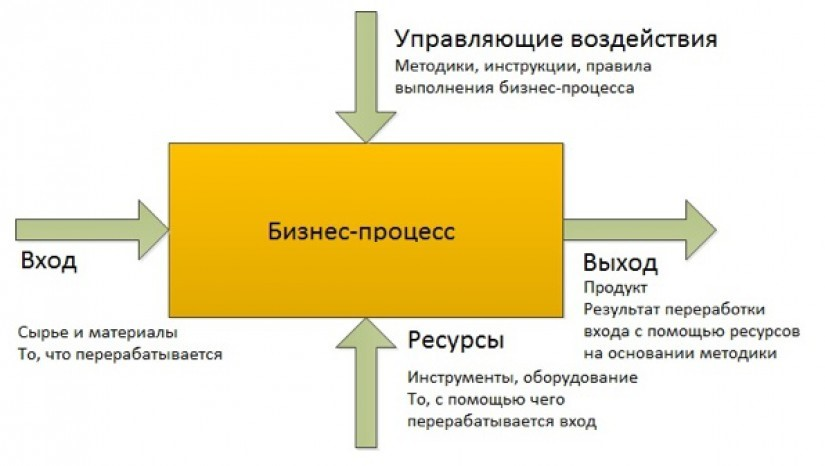
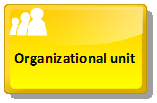
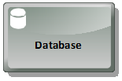
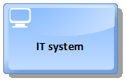
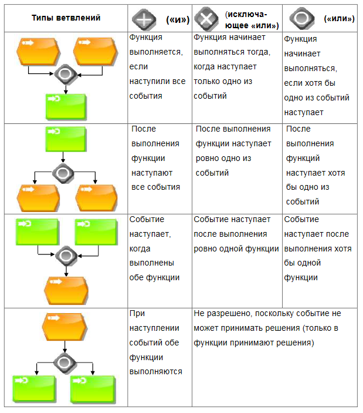
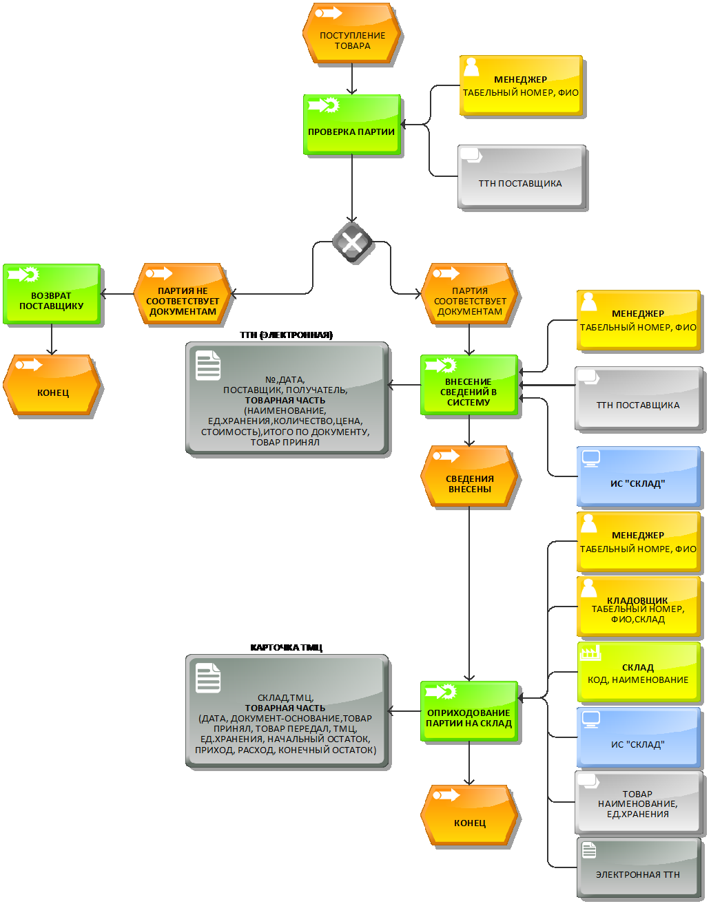

# Лабораторная работа №4 #

## Тема ##

Обследование объекта автоматизации: построение процессной модели.

## Цель работы ##

Построение процессной модели объекта автоматизации.

## Теоретический материал ##

**Бизнес-процесс и его элементы.** Любая современная компания является сложной организационной структурой с большим объемом документов, циркулирующих как внутри компании, так и между компанией и другими физическими и юридическими лицами. Процессный подход позволяет рассматривать деятельность учреждения как связанную систему деловых процессов, каждый из которых протекает во взаимосвязи с другими процессами или внешней средой. В основе процессного подхода лежит понятие
бизнес-процесса.

**Бизнес-процесс** $-$ это совокупность взаимосвязанных мероприятий или работ, выполняемых по определенным технологиям, преобразующим входной поток бизнес-процесса в выходной поток и направленным на создание определённого ценного продукта или услуги для потребителей (Рис.1).
Изучение бизнес-процесса позволяет целостно описать ОА как сложную систему т.к. в нем представлены все составляющие ОА, их функции и взаимосвязи между ними.

**Рис.1 $-$ Схема бизнес-процесса верхнего уровня**

Вход бизнес-процесса $-$ продукт, который в ходе выполнения бизнес-процесса преобразуется в выход. Входы процесса поступают в процесс извне (сырье, материалы, полуфабрикаты, документация, информация, персонал, услуги и т.д.).

Выход бизнес-процесса $-$ результат (продукт, услуга) выполнения бизнес-процесса (готовая продукция, документация, информация, персонал, услуги и т.д.).

Ресурс бизнес-процесса $-$ материальный или информационный объект, постоянно используемый для выполнения процесса, но не являющийся входом процесса (инструменты, оборудование, информационные ресурсы, персонал и т.д.).

Управление бизнес-процесса – ответственное лицо (владелец бизнес-процесса), которое отвечает за слаженное функционирование бизнес-процесса, управляет ходом бизнес-процесса и несет ответственность за результаты бизнес-процесса, а также методики, инструкции, правила, законодательство, согласно которым протекает бизнес-процесс.

**Проектирование процессной модели ОА. Нотация eEPC (Extended Events Process Chain) для проектирования процессной модели.** Процессная модель $-$ описание деятельности предприятия в виде совокупности бизнес-процессов, непрерывных взаимосвязанных функций. Процессное моделирование осуществляется с помощью графических нотаций, текстового описания процессов и создания структуры процессов (например, дерева бизнес-процессов).

Процессная модель описывается в виде последовательности функций, реализуемой отдельными элементами организационной структуры. Модель бизнес-процесса связана с информационными, материальными и/или финансовыми потоками между функциями. Существует ряд нотаций бизнес-процесса, который применяется при моделировании бизнес-процессов. Нотации, как правило отражают концептуальный подход (и методологию) разработчиков нотации к описанию и моделированию бизнес-процессов.

К числу наиболее практически важных, относится основная нотация архитектуры ARIS $-$ нотация eEPC, что означает «расширенная цепочка процесса, управляемого событиями».

Данная методология проектирования рассматривает бизнес-процесс как последовательность событий и действий. Каждый процесс начинается с некоторого события и порождает некоторое действие, которое также порождает некоторое событие. Цепочка бизнес-процесс должна начинаться и заканчиваться событием.

При построении модели в ARIS eEPC должны неукоснительно соблюдаться следующие правила:

+ каждая функция инициируется и завершается событием;
+ в каждую функцию не может входить более одной стрелки, запускающей выполнение функции, и выходить более одной стрелки, описывающей завершение выполнения функции.

В Таблице1 представлены элементы нотации eEPC.

**Таблица 1 $-$ Элементы нотации eEPC**

<table>
    <tbody>
        <tr>
            <td> </td>
            <td>  <b>Event</b> — состояние, которое является существенным для целей управления бизнесом и оказывает влияние или контролирует дальнейшее развитие одного или более бизнес-процессов. Элемент отображает события, активизирующие функции или порождаемые функциями. Внутри блока помещается наименование события. Событие именуется отглагольным существительным.</td>
        </tr>
       <tr>
            <td> </td>
            <td> <b>Activity</b> — действие или набор действий, выполняемых над исходным объектом с целью получения заданного результата. Внутри блока помещается наименование функции (глагол или отглагольное существительное). Временная последовательность выполнения функций задается расположением функций на диаграмме процесса сверху вниз. Функция именуется глаголом или отглагольным существительным.</td>
        </tr>
         <tr>
          <td ></td>
            <td rowspan="4" >См. «Организационная модель ОА».</td>
        </tr>
         <tr>
          <td></td>
        </tr>
         <tr>
          <td></td>
        </tr>
         <tr>
          <td></td>
        </tr>
         <tr>
          <td></td>
            <td ><b>Entity</b>(cущность) — смысловая единица даталогической модели (ER-model, модель «сущность - связь»).</td>
        </tr>
         <tr>
          <td></td>
            <td><b>Database</b> — источник данных.</td>
        </tr>
         <tr>
          <td></td>
            <td ><b>Document</b> — бумажный или электронный носитель информации.</td>
        </tr>
         <tr>
          <td></td>
            <td ><b>IT system</b> — информационная система.</td>
        </tr>
         <tr>
          <td></td>
            <td> <b>Product</b> — ресурс или услуга, используемый как для входа в функцию, так и как результат ее выполнения.</td>
        </tr>
         <tr>
          <td></td>
            <td> <b>Risk</b> — возможная опасность того, что процесс не достигнет цели.</td>
        </tr>
         <tr>
          <td></td>
            <td><b>Process interface</b> — элемент, обозначающий внешний (по отношению к текущей диаграмме) процесс или функцию. Используется для указания взаимосвязи процессов. Обозначает предыдущий или следующий процесс по отношению к диаграмме рассматриваемого процесса; обозначает процесс, откуда поступил или куда передается объект. Внутри блока помещается наименование внешнего процесса.</td>
        </tr>
         <tr>
          <td></td>
            <td ><b>AND (И)</b> — логический оператор, определяющий, что все события (или функции), объединенные данным оператором должны выполняться одновременно.</td>
        </tr>
         <tr>
          <td></td>
            <td><b>XOR</b> (Исключающее ИЛИ) — логический оператор, определяющий, что должно выполняться только одно из событий (или функций), объединенных данным оператором.</td>
        </tr>
         <tr>
          <td></td>
            <td><b>OR (ИЛИ)</b> — логический оператор, определяющий, что должно выполняться хотя бы одно из событий (или функций), объединенных данным оператором.</td>
        </tr>
    </tbody>
</table>

В Таблице 2 представлены типы ветвлений и соединений функций и событий в нотации eEPC.

**Таблица 2 $-$ Типы ветвлений и соединений в нотации eEPC**

**Пример.** Получение товара от поставщика осуществляется визуальным контролем и сопоставлением с сопроводительными документами (ТТН). Данные ТТН вносятся в ИС «СКЛАД». Данную операцию осуществляет менеджер. Далее товар на основании сопроводительной ТМЦ приходуется на склад с внесением сведений о нем в документ «Карточка ТМЦ». Операцию выполняют совместно менеджер и кладовщик.

## Ход работы ##

1. Используя нотацию ARIS eEPC, спроектировать процессную модель объекта автоматизации.
2. Результаты работы отразить в отчете о ходе выполнения лабораторной работы. Подготовить ответы на контрольные вопросы.

## Контрольные вопросы ##

1. Что такое бизнес-процесс?
2. Зачем необходимо проектировать процессную модель объекта автоматизации?
3. Какие нотации в среде ARIS используются для проектирования процессной модели?
4. Расскажите о нотации eEPC, о ее назначении и основных требованиях к построению моделей в этой нотации.
5. Расскажите о элементах нотации eEPC и их назначении.
6. Расскажите о вариантах ветвлений и соединений событий и функций в нотации eEPC.
