# Лабораторная работа №5 #

## РАЗРАБОТКА ЛОКАЛЬНЫХ КОНЦЕПТУАЛЬНЫХ МОДЕЛЕЙ ДЛЯ БД ОА ##

## СОДЕРЖАНИЕ ##

1. [ПОСТАНОВКА ЗАДАЧ НА ЛАБОРАТОРНУЮ РАБОТУ](#1-постановка-задач-на-лабораторную-работу)
2. [МЕТОДИКА ПОСТРОЕНИЯ КОНЦЕПТУАЛЬНОЙ МОДЕЛИ](#2-методика-построения-концептуальной-модели)
3. [ИДЕНТИФИКАЦИЯ ЛОКАЛЬНЫХ КОНЦЕПТУАЛЬНЫХ МОДЕЛЕЙ](#3-идентификация-локальных-концептуальных-моделей)
4. [РАЗРАБОТКА ЛОКАЛЬНЫХ КОНЦЕПТУАЛЬНЫХ МОДЕЛЕЙ](#4-разработка-локальных-концептуальных-моделей)
    + 4.1[Определение сущностей](#41-определение-сущностей)
       + 4.1.1 [Определение сущностей для ЛКМ1](#411-определение-сущностей-для-лкм1)
       + 4.1.2 [Определение сущностей для ЛКМ2, ЛКМ3 и т.д.](#412-определение-сущностей-для-лкм2-лкм3-и-тд)
    + 4.2 [Определение связей между сущностями в ЛКМ](#42-определение-связей-между-сущностями-в-лкм)
       + [Определение связей между сущностями для ЛКМ1](#421-определение-связей-между-сущностями-для-лкм1)
       + 4.2.2 [Определение связей между сущностями для ЛКМ2, ЛКМ2 и т.д.](#422-определение-связей-между-сущностями-для-лкм2-лкм2-и-тд)
    + 4.3 [Определение атрибутов сущностей и их анализ](#43-определение-атрибутов-сущностей-и-их-анализ)
    + 4.4 [Определение первичных ключей](#44-определение-первичных-ключей)
    + 4.5 [Определение доменов атрибутов](#45-определение-доменов-атрибутов)
5. [ДОКУМЕНТИРОВАНИЕ РЕЗУЛЬТАТОВ РАБОТЫ](#5-документирование-результатов-работы)\
[ПРИЛОЖЕНИЕ А. КРАТКОЕ ОПИСАНИЕ ПРИМЕРА ОА](#приложение-а-краткое-описание-примера-оа)\
[ПРИЛОЖЕНИЕ Б. ПРИМЕРЫ ЛКМ ДЛЯ ОПЕРАТИВНЫХ ДОКУМЕНТОВ](#приложение-б-примеры-лкм-для-оперативных-документов)

## 1. ПОСТАНОВКА ЗАДАЧ НА ЛАБОРАТОРНУЮ РАБОТУ ##

## ЦЕЛЬ ##

Формирование знаний и умений по проектированию и документированию концептуальных моделей (КМ) базы данных (БД) для заданного объекта автоматизации (ОА).

## ЗАДАЧИ ##

1. Изучить методику построения КМ на предложенном примере.
2. Разработать КМ для заданного варианта ОА.
3. Провести анализ КМ и уточнить ее компоненты (сущности, связи, атрибуты, домены и ключи).
4. Документировать КМ БД.

## ИСХОДНЫЕ ДАННЫЕ ##

1. Приложение 1 к заданию на курсовое проектирование.
2. Результаты выполнения лабораторных работ №1 и №2.

## РЕЗУЛЬТАТ ВЫПОЛНЕНИЯ РАБОТЫ ##

Отчет по лабораторной работе $-$ это документация на КМ в виде следующих компонент:

+ Диаграмма «сущность-связь» для КМ (см. рис.4.5).
+ Описание сущностей (см. табл.4.4).
+ Описание связей (см. табл.4.6).
+ Описание атрибутов для каждой сущности (см. табл.4.7).
+ Описание ключей (см. табл.4.8).
+ Описание доменов (см. табл. 4.9).

## МЕТОДИЧЕСКОЕ ОБЕСПЕЧЕНИЕ ##

1. Методическое пособие по теме «Проектирование концептуальной модели базы данных» по дисциплине ББД.  Брест, БГТУ, кафедра ИИТ, 2012, электронный вариант.

***Примечание: документирование результатов рекомендуется выполнять после выполнения лабораторной работы №4 (Объединение ЛКМ в единую КМ БД ОА»).***

## 2. МЕТОДИКА ПОСТРОЕНИЯ КОНЦЕПТУАЛЬНОЙ МОДЕЛИ ##

**Методика разработки КМ БД для ОА.** Используется подход к построению КМ «от документов» и представляется в виде следующих этапов:

1. **Идентификация ЛКМ.**
2. **Разработка локальных КМ (ЛКМ)** включает выполнение следующих работ:

+ Определение сущностей (см. п.3.1).
+ Определение связей между сущностями (см. п.3.2).
+ Определение атрибутов сущностей и их анализ (см. п.3.3).
+ Определение первичных ключей для сущностей (см. п.3.3.4).
+ Определение доменов (см. п.3.5).

3. **Объединение ЛКМ в единую КМ ОА.**
4. **Анализ и уточнение КМ** включает выполнение следующих работ:

+ Анализ реализуемости «оперативных задач».
+ Анализ реализуемости «отчетных задач».

5. **Документирование КМ (см.п.5).**

В предложенной методике использован ряд упрощений и допущений по сравнению с «классическим подходом к проектированию КМ», а именно: упрощение описания атрибутов и ключей и другие.

**Исходные данные.** В качестве исходных данных для выполнения данной лабораторной работы используются результаты, полученные при выполнении предыдущих лабораторных работ по дисциплине: каталоги документ и задач, макеты документов, схема информационных взаимосвязей между документами.

В качестве варианта примера рассмотрим ОА «Успеваемость студентов факультета» (далее $-$ «Успеваемость»), фрагмент которого приведен в приложении А.

## 3. ИДЕНТИФИКАЦИЯ ЛОКАЛЬНЫХ КОНЦЕПТУАЛЬНЫХ МОДЕЛЕЙ ##

**Цель данной работы** $-$ это определение и нумерация набора локальных КМ (ЛКМ) для заданного ОА (рабочего места). В качестве нумерации для ЛКМ предлагается следующее обозначение: ЛКМ1, ЛКМ2 и т.д. Нумерация ЛКМ в ОА $-$ сквозная.

Исходной информацией является каталог документов (справочных и оперативных) ОА. Отчетные документы ОА используются для решения вспомогательных задач при проектировании КМ.

Данная работа включает выполнение следующих задач:

1. **Определение одной ЛКМ1 для всех справочных документов из ОА** и ее нумерация.  Например, для ОА «Успеваемость» $-$ **ЛКМ1**, для построения которой будут использованы следующие справочные документы:

+ **Дисциплины.**
+ **Преподаватели.**
+ **Факультеты.**
+ **Специальности.**
+ **Группы.**
+ **Студенты.**

2. **Определение для каждого оперативного документа** ОА **отдельной ЛКМ** и их нумерация. Например, для ОА «Успеваемость» определено в каталоге документов два оперативных документа (Направление и Экзаменационная ведомость). Поэтому необходимо определить еще две ЛКМ (для каждого оперативного документа разрабатывается своя отдельная ЛКМ) для ОА и присвоить им номера (ЛКМ2 и ЛКМ3):

+ ЛКМ2  $-$ для оперативного документа **Направление на ликвидацию задолженности;**
+ ЛКМ3  $-$ для оперативного документа **Экзаменационная ведомость.**

## 4. РАЗРАБОТКА ЛОКАЛЬНЫХ КОНЦЕПТУАЛЬНЫХ МОДЕЛЕЙ ##

Данный этап выполняется отдельно для каждой ЛКМ, которые определены на предыдущем этап (идентификация ЛКМ для ОА).  В связи с тем, что данный этап выполняется для каждой отдельной ЛКМ и при их документировании получается достаточно много результатов (таблиц), поэтому следует придерживаться следующих рекомендаций при оформлении результирующих таблиц:

1. Таблицы описание сущностей, ключей, связей и доменов делать общими для всей КМ, а внутри их разделять на отдельные ЛКМ.  Например, в таблице 4.1 приведен фрагмент описания сущностей для ЛКМ ОА «Успеваемость». При этом, отдельные сущности в разных ЛКМ могут повторяться.

**Таблица 4.1 Описание сущностей КМ**

<table>
    <thead>
        <tr>
            <th>№п/п</th>
            <th>Имя сущности</th>
            <th>Описание сущности</th>
            <th>Псевдонимы</th>
            <th>Особенности использования сущности</th>
         </tr>
    </thead>
    <tbody>
        <tr>
           <td  colspan="5"><b>ЛКМ1</b></td>
        </tr>
       <tr>
            <td ></td>
            <td>Группа</td>
            <td>Организационное подразделение студентов</td>
            <td></td>
            <td>Группа состоит из студентов. Отдельная группа входит в состав факультета</td>
        </tr>
         <tr>
            <td align="center"></td>
            <td align="center">...</td>
             <td align="center">...</td>
              <td align="center">...</td>
               <td align="center">...</td>
        </tr>
          <tr>
           <td  colspan="5"><b>ЛКМ2</b></td>
        </tr>
         <tr>
            <td></td>
            <td>Направление</td>
            <td>Документ, в котором фиксируются результаты по ликвидации задолженности</td>
            <td></td>
            <td>Документ, в котором фиксируются результаты по ликвидации задолженности</td>
        </tr>
         <tr>
            <td align="center"></td>
            <td align="center">...</td>
             <td align="center">...</td>
              <td align="center">...</td>
               <td align="center">...</td>
        </tr>
         <tr>
           <td  colspan="5"><b>ЛКМ3</b></td>
        </tr>
         <tr>
            <td></td>
            <td>ЭкзВедомость</td>
            <td>Документ для регистрации результатов аттестации студентов по указанной дисциплине</td>
            <td></td>
            <td>Студент может выполнять несколько проектов</td>
        </tr>
         <tr>
            <td align="center"></td>
            <td align="center">...</td>
             <td align="center">...</td>
              <td align="center">...</td>
               <td align="center">...</td>
        </tr>
    </tbody>
</table>
2. Для таблицы описание атрибутов сущностей КМ рекомендуется выделять описания атрибутов отдельной сущности идентифицирующей строкой (например, сущность «Дисциплина») и все сущности для каждой ЛКМ представлять в виде отдельной совокупности в таблице. Фрагмент организации данной таблицы приведен в таблице 4.2.

**Таблица 4.2 Описания атрибутов сущностей КМ**

<table>
    <thead>
        <tr>
            <th>№п/п</th>
            <th>Имя атрибута</th>
            <th>Назначение атрибута</th>
            <th>Тип данных (длина) </th>
            <th>Ограничения </th>
            <th>Значение по умолчанию </th>
            <th>Псевдоним</th>
            <th>Допустимость NULL </th>
            <th>Производный</th>
         </tr>
    </thead>
    <tbody>
        <tr>
           <td  colspan="9"><b>ЛКМ1</b></td>
        </tr>
        <tr>
           <td  colspan="9" align="center"><b><b>Сущность «Дисциплина»</b></b></td>
        </tr>
       <tr>
            <td  align="center">1</td>
            <td>НазвДисц</td>
            <td>Сокращенное название дисциплины</td>
            <td align="center">Текстовый</td>
            <td align="center"></td>
            <td align="center"></td>
            <td align="center"></td>
            <td align="center"></td>
            <td align="center">Нет</td>
        </tr>
         <tr>
            <td align="center"></td>
            <td align="center">...</td>
             <td align="center">...</td>
              <td align="center">...</td>
               <td align="center">...</td>
               <td align="center">...</td>
             <td align="center">...</td>
              <td align="center">...</td>
               <td align="center">...</td>
        </tr>
          <tr>
           <td  colspan="9" align="center"><b>Сущность «Преподаватель»</b></td>
        </tr>
         <tr>
           <td  align="center">1</td>
            <td>ФИО преподавателя</td>
            <td>Фамилия, имя, отчество преподавателя</td>
            <td align="center">Текстовый</td>
            <td align="center"></td>
            <td align="center"></td>
            <td align="center"></td>
            <td align="center"></td>
            <td align="center">Нет</td>
        </tr>
         <tr>
            <td align="center"></td>
            <td align="center">...</td>
             <td align="center">...</td>
              <td align="center">...</td>
               <td align="center">...</td>
                <td align="center">...</td>
             <td align="center">...</td>
              <td align="center">...</td>
               <td align="center">...</td>
        </tr>
         <tr>
           <td  colspan="9"><b>ЛКМ2</b></td>
        </tr>
         <tr>
           <td  colspan="9" align="center"><b>Сущность «Направление»</b></td>
        </tr>
        <tr>
           <td  align="center">1</td>
            <td>НомДок</td>
            <td>Номер документа</td>
            <td>Числовой</td>
            <td></td>
            <td></td>
            <td></td>
            <td></td>
            <td align="center">Нет</td>
        </tr>
         <tr>
            <td align="center"></td>
            <td align="center">...</td>
             <td align="center">...</td>
              <td align="center">...</td>
               <td align="center">...</td>
               <td align="center">...</td>
             <td align="center">...</td>
              <td align="center">...</td>
               <td align="center">...</td>
        </tr>
    </tbody>
</table>

### 4.1 Определение сущностей ###

**Цель данной работы** $-$ определение набора сущно¬стей для каждой отдельной ЛКМ и документиро-ва¬ние их в табличной форме представления (см. табл.4.3). Для документирования ЛКМ используются рекомендации приведенные в п.4.

Исходной информацией для построения сущностей являются макеты документов ОА.

Для ЛКМ1 и остальных ЛКМ ОА (ЛКМ2, ЛКМ3 и т.д.) существует ряд особенности определения сущностей. Поэтому работа по определению сущностей для этих групп ЛКМ рассмотрена ниже отдельно.

#### 4.1.1 Определение сущностей для ЛКМ1 ####

Определение сущностей для ЛКМ1 осуществляется следующим образом:

1. **Для каждого отдельного справочного документа определяется отдельная сущность.** В качестве первоначального перечня сущно¬стей ОА используются справочные документы. Названия (обозначения) для сущностей определяет разработчик.

2. **Описание сущностей.** Для каждой сущности необходимо определить следующие характеристики: имя сущности, описание сущности, псевдоним (не обязательно) и особенности использования сущности (не обязательно). Фрагмент описания сущностей ЛКМ1 для ОА «Успеваемость» приведен в таблице 4.3

**Таблица 4.3 Описание сущностей**

<table>
    <thead>
        <tr>
            <th align="center">№п/п</th>
            <th align="center">Имя сущности</th>
            <th align="center">Описание сущности</th>
            <th align="center">Псевдонимы</th>
            <th align="center">Особенности использования сущности</th>
         </tr>
    </thead>
    <tbody>
        <tr>
           <td  colspan="5"><b>ЛКМ1</b></td>
        </tr>
       <tr>
            <td ></td>
            <td >Факультет</td>
            <td>Организационное подразделение вуза</td>
            <td></td>
            <td ></td>
        </tr>
         <tr>
            <td></td>
            <td>Специальность</td>
             <td>Название специальности, по которой в вузе проводится обучение</td>
              <td ></td>
               <td>Название специальности имеет сокращенное назва¬ние и государственный код</td>
         <tr>
            <td ></td>
            <td>Группа</td>
            <td>Организационное подразделение студентов</td>
            <td align="center"></td>
            <td>Отдельный студент входит в одну из групп </td>
        </tr>
        <tr>
            <td></td>
            <td>Студенты</td>
            <td>Учащиеся, которые входит в состав группы</td>
            <td align="center">Учащийся</td>
            <td>Группа состоит из студентов. Отдельная группа входит в состав факультета</td>
        </tr>
         <tr>
            <td  align="center"></td>
            <td>Дисциплина</td>
            <td>Предмет, по которому проводится обу-чение студентов</td>
            <td align="center">Предмет</td>
            <td>По дисциплине проводятся занятия, выполняются проекты и лабораторные занятия</td>
        </tr>
         <tr>
            <td></td>
            <td>Преподаватель</td>
            <td>Сотрудник кафедры, который принимает экзамен</td>
            <td align="center" >Сотрудник</td>
            <td>Сотрудник входит в состав кафедры. Кафедра входит в состав факультета</td>
        </tr>
    </tbody>
</table>

Если сущность известна пользователям под разными именами, все дополнительные имена рекомендуется определять как псевдонимы (алиасы, синонимы).

### 4.1.2 Определение сущностей для ЛКМ2, ЛКМ3 и т.д. ###

**Цель данной работы** $-$ декомпозиция оперативного документа на совокупность сущностей, которые его определяют, и их документирование.

Для каждой ЛКМ2, ЛКМ3 и других ЛКМ ОА определение сущностей выполняется отдельно. Это вызвано тем, что оперативные документы, положенные в основу для построения этих ЛКМ, являются сложными по структуре и содержанию документами.

В качестве примера для определения ЛКМ2 рассмотрим документ, представленный на рисунке 4.1.

**Рисунок 4.1 $-$ Макет оперативного документа «Направление на ликвидацию задолженности».**

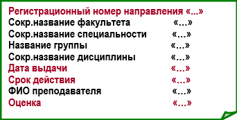

Для построения таких ЛКМ выполняется последовательность следующих работ.

1. `Декомпозиция оперативного документа на совокупность сущностей.` Для примера можно использовать примеры ЛКМ для некоторых оперативных документов, которые приведены в приложении Б. Названия (обозначения) для сущностей определяет разработчик. Для оперативного документа Направление … определение сущностей выполняется следующим образом:

    + Определяется основная сущность, совпадающая с названием оперативного документа $-$ сущность `Направление.` Ее содержание составляет оперативная часть из макета документа (регистрационный номер документа, дата выдачи документа, срок действия документа, оценка).
    + Далее анализируется оставшаяся часть содержания документа. На основе ее анализа определяются независимые от документа сущности. В данном документе содержится совокупность информации, которая позволяет определить следующие отдельные сущности:

        + Факультет $-$ в документе Направлении … используется название факультета.
        + Специальность $-$ в документе Направлении … используется название специальности.
        + Группа $-$ в документе Направлении … используется название группы.
        + Студент $-$ в документе Направлении используется ФИО студента.
        + Дисциплина $-$ в документе Направлении используется название дисциплины.
        + Преподаватель $-$ в документе Направлении используется ФИО преподавателя.
Все перечисленные данные позволяют определить отдельные экземпляры сущностей `Факультет, Специальность, Группа, Студент, Дисциплина, Преподаватель.`

Таким образом, в процессе декомпозиции для ЛКМ2 на совокупность сущностей определены следующие сущности: `Направление, Факультет, Специальность, Группа, Студент, Дисциплина, Преподаватель.`

2. `Описание сущностей.` В таблицу табл.4.3 добавляются сущности, которые определены для ЛКМ2. Результат представлен в табл.4.4. Для каждой сущности необходимо определить следующие характеристики: имя сущности, описание сущности, псевдоним (не обязательно) и особенности использования сущности (не обязательно).

Следует отметить, что в табл.4.3 (табл.4.4) возможно повторное описание одинаковых сущностей для разных ЛКМ.

**Таблица 4.4 Описание сущностей**

<table>
    <thead>
        <tr>
            <th>№п/п</th>
            <th>Имя сущности</th>
            <th>Описание сущности</th>
            <th>Псевдонимы</th>
            <th>Особенности использования сущности</th>
         </tr>
    </thead>
    <tbody>
    <tr>
           <td  colspan="5"><b>ЛКМ1</b></td>
        </tr>
        <tr>
            <td ></td>
            <td >Факультет</td>
            <td>Организационное подразделение вуза</td>
            <td></td>
            <td ></td>
        </tr>
         <tr>
            <td></td>
            <td>Специальность</td>
             <td>Название специальности, по которой в вузе проводится обучение</td>
              <td ></td>
               <td>Название специальности имеет сокращенное название и государственный код</td>
         <tr>
            <td ></td>
            <td>Группа</td>
            <td>Организационное подразделение студентов</td>
            <td align="center"></td>
            <td>Отдельный студент входит в одну из групп </td>
        </tr>
        <tr>
            <td></td>
            <td>Студенты</td>
            <td>Учащиеся, которые входит в состав группы</td>
            <td align="center">Учащийся</td>
            <td>Группа состоит из студентов. Отдельная группа входит в состав факультета</td>
        </tr>
         <tr>
            <td  align="center"></td>
            <td>Дисциплина</td>
            <td>Предмет, по которому проводится обучение студентов</td>
            <td align="center">Предмет</td>
            <td>По дисциплине проводятся занятия, выполняются проекты и лабораторные занятия</td>
        </tr>
         <tr>
            <td></td>
            <td>Преподаватель</td>
            <td>Сотрудник кафедры, который принимает экзамен</td>
            <td align="center" >Сотрудник</td>
            <td>Сотрудник входит в состав кафедры. Кафедра входит в состав факультета</td>
        </tr>
        <tr>
           <td  colspan="5"><b>ЛКМ2</b></td>
        </tr>
         <tr>
            <td ></td>
            <td >Факультет</td>
            <td>Организационное подразделение вуза</td>
            <td></td>
            <td ></td>
        </tr>
         <tr>
            <td></td>
            <td>Специальность</td>
             <td>Название специальности, по которой в вузе проводится обучение</td>
              <td ></td>
               <td>Название специальности имеет сокращенное название и государственный код</td>
         <tr>
            <td ></td>
            <td>Группа</td>
            <td>Организационное подразделение студентов</td>
            <td align="center"></td>
            <td>Отдельный студент входит в одну из групп </td>
        </tr>
        <tr>
            <td></td>
            <td>Студенты</td>
            <td>Учащиеся, которые входят в состав группы</td>
            <td align="center">Учащийся</td>
            <td>Группа состоит из студентов. Отдельная группа входит в состав факультета</td>
        </tr>
         <tr>
            <td  align="center"></td>
            <td>Дисциплина</td>
            <td>Предмет, по которому проводится обучение студентов</td>
            <td align="center">Предмет</td>
            <td>По дисциплине проводятся занятия, выполняются проекты и лабораторные занятия</td>
        </tr>
         <tr>
            <td></td>
            <td>Преподаватель</td>
            <td>Сотрудник кафедры, который принимает экзамен</td>
            <td align="center" >Сотрудник</td>
            <td>Сотрудник входит в состав кафедры. Кафедра входит в состав факультета</td>
        </tr>
        <tr>
        <tr>
           <td  align="center"></td>
            <td>Направление</td>
            <td>Документ для регистрации результатов ликвидации задолженности</td>
            <td></td>
            <td>Направление относится к заданной дисциплине. Одно направление выдается для одной дисциплины</td>
        </tr>
    </tbody>
</table>

### 4.2 Определение связей между сущностями в ЛКМ ###

`Цель данной работы` $-$ это определение и документирование связей, которые существуют между отдельными сущностями в рамках каждой ЛКМ.

Для этой цели рекомендуется использовать как графическое, так и табличное представление связей между сущностями.

#### 4.2.1 Определение связей между сущностями для ЛКМ1 ####

Определение связей для ЛКМ1включает решение следующих задач:

1. Определение связей между сущностями ЛКМ1 на основе информационных связей между справочными документами. Каждой информационной связи между документами соответствует связь между сущностями, которые определены для этих документов.
2. Определение типа связей между сущностями. Для каждой информационной связи определяется ее тип (кардинальность, см. [1]): 1:1; 1:N; N:M. Для наглядности возможно использование надписи типа связи над стрелкой.
3. Описание связей между сущностями в табличном виде (см. табл.4.5).
Приме определения связей между сущностями ЛКМ1 для ОА «Успеваемость» приведены на рисунке 4.2 и описаны в табл.4.5

**Рисунок 4.2 – Пример связей между сущностями в ЛКМ1 для ОА «Успеваемость»**

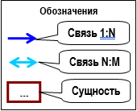

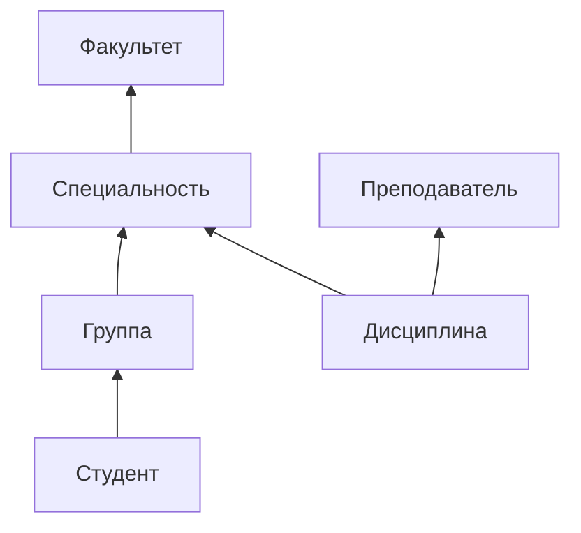

**Таблица 4.5 Описание связей между сущностями в КМ**

<table>
    <thead>
        <tr>
            <th>№п/п</th>
            <th>Имя сущности 1</th>
            <th>Имя связи</th>
            <th>Имя сущности 2</th>
            <th>Кардинальность</th>
         </tr>
    </thead>
    <tbody>
          <tr>
           <td  colspan="5"><b>ЛКМ1</b></td>
        </tr>
       <tr>
            <td align="center" >1</td>
            <td >Факультет</td>
            <td>На факультете обучаются студенты по нескольким специальностям</td>
            <td>Специальность</td>
            <td align="center">1:N</td>
        </tr>
         <tr>
            <td align="center">2</td>
            <td>Специальность</td>
             <td>По одной специальности обучается несколько групп студентов</td>
              <td >Группа</td>
               <td align="center">1:N</td>
         <tr>
            <td align="center">3</td>
            <td>Группа</td>
            <td>В состав группы входит определенное количество студентов</td>
            <td >Студент</td>
            <td align="center">1:N</td>
        </tr>
         <tr>
            <td  align="center">4</td>
            <td>Дисциплина</td>
            <td>По специальности студенты сдают экзамены по многим дисциплинам</td>
            <td>Специальность</td>
            <td align="center"> 1:N</td>
        </tr>
         <tr>
            <td align="center">5</td>
            <td>Преподаватель</td>
            <td>Преподаватель может принимать экзамены по нескольким дисциплинам</td>
            <td>Дисциплина</td>
            <td align="center"> 1:N</td>
        </tr>
    </tbody>
</table>

**Примечание. Для большинства вариантов ОА связи между сущностями для ЛКМ1 могут отсутствовать!!!**

#### 4.2.2 Определение связей между сущностями для ЛКМ2, ЛКМ2 и т.д. ####

Определение связей для ЛКМ2 включает решение следующих задач:

1. **Определение связей между основной сущностью ЛКМ2** (например, **Направление) и другими сущностями,** которые получены в результате декомпозиции оперативного документа …
2. **Определение типа связей между сущностями.** Для каждой информационной связи определяет-ся ее тип (кардинальность, см. рис.3.2): 1:1; 1:N; N:M. Для наглядности возможно использование надписи типа связи над стрелкой.
3. **Описание связей между сущностями** в табличном виде (см. табл.4.5).\
Пример определения связей для ЛКМ2 ОА «Успеваемость» приведен в табл.4.6 и представлены на рисунке 4.3.

**Таблица 4.6 Описание связей между сущностями в КМ**
<table>
    <thead>
        <tr>
            <th>№п/п</th>
            <th>Имя сущности 1</th>
            <th>Имя связи</th>
            <th>Имя сущности 2</th>
            <th>Кардинальность</th>
         </tr>
    </thead>
    <tbody>
        <tr>
           <td  colspan="5"> <b> ЛКМ1 </b></td>
        </tr>
       <tr>
            <td align="center" >1</td>
            <td >Факультет</td>
            <td>На факультете обучаются студенты по нескольким специальностям</td>
            <td>Специальность</td>
            <td align="center">1:N</td>
        </tr>
         <tr>
            <td align="center">2</td>
            <td>Специальность</td>
             <td>По одной специальности обучается несколько групп студентов</td>
              <td >Группа</td>
               <td align="center">1:N</td>
         <tr>
            <td align="center">3</td>
            <td>Группа</td>
            <td>В состав группы входит определенное количество студентов</td>
            <td >Студент</td>
            <td align="center">1:N</td>
        </tr>
         <tr>
            <td  align="center">4</td>
            <td>Дисциплина</td>
            <td>По специальности студенты сдают экзамены по многим дисциплинам</td>
            <td>Специальность</td>
            <td align="center"> 1:N</td>
        </tr>
         <tr>
            <td align="center">5</td>
            <td>Преподаватель</td>
            <td>Преподаватель может принимать экзамены по нескольким дисциплинам</td>
            <td>Дисциплина</td>
            <td align="center"> 1:N</td>
        </tr>
        <td  colspan="5"><b>ЛКМ2</b></td>
       <tr>
            <td align="center" >1</td>
            <td >Направление</td>
            <td>На факультете выдается много направлений</td>
            <td>Факультет</td>
            <td align="center">1:N</td>
        </tr>
         <tr>
            <td align="center">2</td>
            <td>Направление</td>
             <td>По специальности выдается много направлений</td>
              <td >Специальность</td>
               <td align="center">1:N</td>
         </tr>
          <tr>
            <td align="center">3</td>
            <td>Направление</td>
            <td>Для группы может быть выдается много направлений</td>
            <td>Группа</td>
            <td align="center">1:N</td>
        </tr>
         <tr>
            <td  align="center">4</td>
            <td>Направление</td>
            <td>Для студента может быть выдается несколько направлений</td>
            <td>Студент</td>
            <td align="center"> 1:N</td>
        </tr>
    </tbody>
</table>

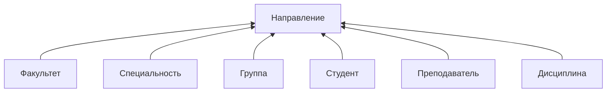

**Рисунок 4.3 $-$ Пример графического представления связей между сущностями
в ЛКМ2 для ОА «Успеваемость»**

### 4.3 Определение атрибутов сущностей и их анализ ###

`Цель данной работы` $-$ это определение и документирование атрибутов, которые определяют свойства отдельной сущности КМ. Документирование атрибутов реализуется в табличной форме представления (см. табл.4.4). Исходной информацией для выполнения данной работы являются макеты документов (и словарь данных). Для удобства используется графический способ представления КМ (см. рис.4.4, рис. 4.5).
Данная работа предполагает решение следующих задач:

1. Заполнение сущностей ЛКМ1 атрибутами из макетов справочных документов (пример см. рис.4.4).
2. Анализ атрибутов сущностей из ЛКМ1 $-$ они не должны повторяться в разных сущностях.
3. Заполнение сущностей из ЛКМ2, ЛКМ3 и т.д. атрибутами из макетов соответствующих оперативных документов.
4. Анализ атрибутов для каждой сущностей из ЛКМ2, ЛКМ3 и т.д.:

    + `Повторно определенные одиночные атрибуты.` Если существуют такие атрибуты, то в одной из сущности они удаляются.
    + `Чужие атрибуты.` К этой группе относятся атрибуты, которые не описывают свойства данной сущности. Проводится анализ каждого из таких атрибутов. Если атрибут является свойством уже существующих сущностей КМ то этот атрибут переносится в эту сущность. Остальные «чужие атрибуты» необходимо выделить в отдельные сущности и добавить в КМ (определяется отдельная сущность, ее атрибуты и связи с другими сущностями).
    + `Групповые атрибуты.` Если в сущности есть групповые элементы, то они выделяются в отдельную сущность.
В качестве примера в табл.4.7 приведены описания нескольких атрибутов для сущностей для разных ЛКМ и разных сущностей.

**Таблица 4.7 Описания атрибутов сущностей КМ**
<table>
    <thead>
        <tr>
            <th>№п/п</th>
            <th>Имя атрибута</th>
            <th>Назначение атрибута</th>
            <th>Тип данных (длина) </th>
            <th>Ограничения </th>
            <th>Значение по умолчанию </th>
            <th>Псевдоним</th>
            <th>Допустимость NULL </th>
            <th>Производный</th>
         </tr>
    </thead>
    <tbody>
        <tr>
           <td  colspan="9"><b>ЛКМ1</b></td>
        </tr>
        <tr>
           <td  colspan="9" align="center"><b><b>Сущность «Дисциплина»</b></b></td>
        </tr>
       <tr>
            <td  align="center">1</td>
            <td>НазвДисц</td>
            <td>Сокращенное название дисциплины</td>
            <td align="center">Текстовый</td>
            <td align="center"></td>
            <td align="center"></td>
            <td align="center"></td>
            <td align="center"></td>
            <td align="center">Нет</td>
        </tr>
         <tr>
            <td align="center"></td>
            <td align="center">...</td>
             <td align="center">...</td>
              <td align="center">...</td>
               <td align="center">...</td>
               <td align="center">...</td>
             <td align="center">...</td>
              <td align="center">...</td>
               <td align="center">...</td>
        </tr>
          <tr>
           <td  colspan="9" align="center"><b>Сущность «Преподаватель»</b></td>
        </tr>
         <tr>
           <td  align="center">1</td>
            <td>ФИО преподавателя</td>
            <td>Фамилия, имя, отчество преподавателя</td>
            <td align="center">Текстовый</td>
            <td align="center"></td>
            <td align="center"></td>
            <td align="center"></td>
            <td align="center"></td>
            <td align="center">Нет</td>
        </tr>
         <tr>
            <td align="center"></td>
            <td align="center">...</td>
             <td align="center">...</td>
              <td align="center">...</td>
               <td align="center">...</td>
                <td align="center">...</td>
             <td align="center">...</td>
              <td align="center">...</td>
               <td align="center">...</td>
        </tr>
         <tr>
           <td  colspan="9"><b>ЛКМ2</b></td>
        </tr>
         <tr>
           <td  colspan="9" align="center"><b>Сущность «Направление»</b></td>
        </tr>
        <tr>
           <td  align="center">1</td>
            <td>НомДок</td>
            <td>Номер документа</td>
            <td>Числовой</td>
            <td></td>
            <td></td>
            <td></td>
            <td></td>
            <td align="center">Нет</td>
        </tr>
         <tr>
            <td align="center"></td>
            <td align="center">...</td>
             <td align="center">...</td>
              <td align="center">...</td>
               <td align="center">...</td>
               <td align="center">...</td>
             <td align="center">...</td>
              <td align="center">...</td>
               <td align="center">...</td>
        </tr>
    </tbody>
</table>

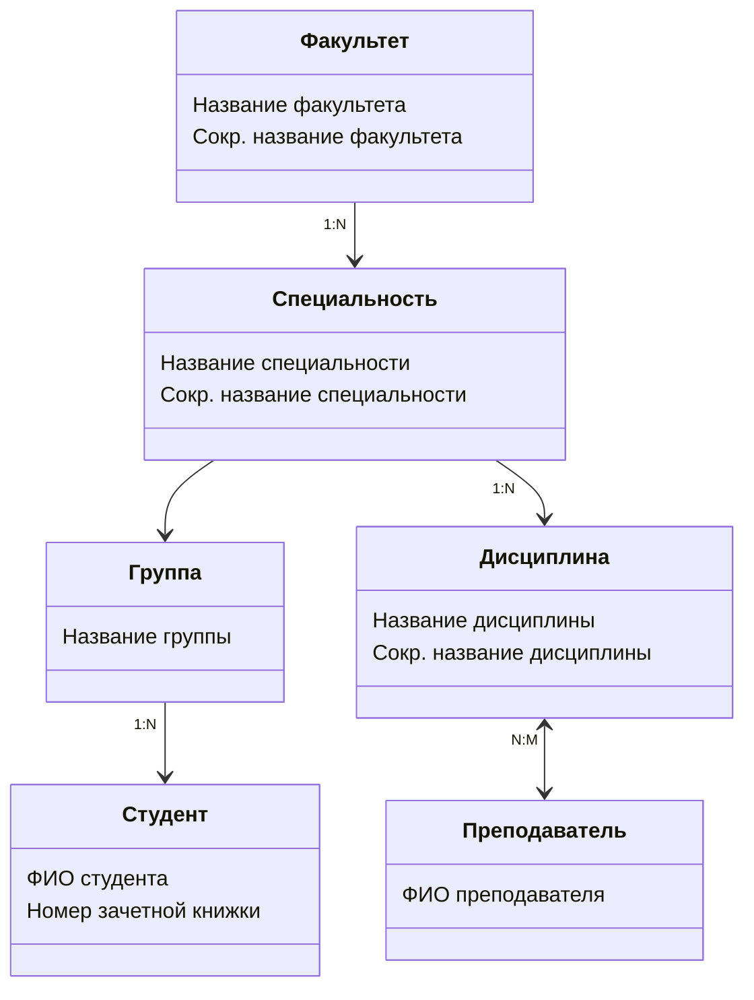
**Рисунок 4.4 $-$ Пример графического представления атрибутов сущностей и связей между сущностями для ЛКМ1 (диаграмма «сущность-связь»)**

### 4.4 Определение первичных ключей ###

`Определение и документирование первичных ключей.` Рекомендуется в качестве первичных ключей для всех сущностей КМ ввести дополнительный атрибут, который будет определять первичный ключ сущностей. Пример ключей для сущностей КМ представлен на рис.3.7. Ключи выделены подчеркиванием. Для описания ключей используется табл.3.4.

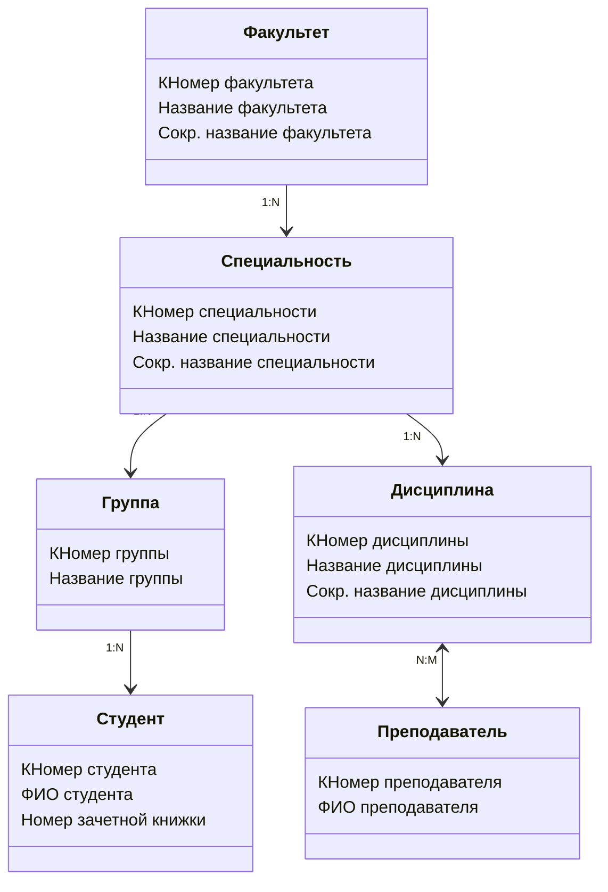

**Рисунок 4.5 $-$ Пример диаграммы «сущность-связь» после добавления ключевых атрибутов для ЛКМ1**

|№ п/п|Имя сущности|Первичный ключ|
|---|---|---|
|1|Факультет|КНомер факультета|
|2|Преподаватель|КНомер преподавателя|
|...|...|...|

**Таблица 4.7 Описания атрибутов сущностей КМ**

### 4.5 Определение доменов атрибутов ###
`Определение и документирование доменов атрибутов.` Пример описания доменов приведен в табл.4.9.
<table>
    <thead>
        <tr>
            <th>№п/п</th>
            <th>Имя домена</th>
            <th>Характеристики домена</th>
            <th>Примеры допустимых значений</th>
            <th>Примечание</th>
         </tr>
    </thead>
    <tbody>
        <tr>
           <td  colspan="5"><b>ЛКМ1</b></td>
        </tr>
        <tr>
           <td  align =" center"colspan="5"><b>Сущность «Семестр»</b></td>
        </tr>
       <tr>
            <td align="center" >1</td>
            <td >Номер семестра</td>
            <td>Целое число</td>
            <td>1-8</td>
            <td>Для студентов по новому стандарту (стационар)</td>
        </tr>
         <tr>
            <td align="center">2</td>
            <td>Номер семестра</td>
             <td>Целое число</td>
              <td >1-10</td>
               <td>Для студентов по новому стандарту (заочное обу-чение)</td>
         <tr>
            <td align="center">...</td>
            <td align="center">...</td>
            <td align="center">...</td>
            <td align="center">...</td>
            <td align="center">...</td>
        </tr>
    </tbody>
</table>

**Таблица 4.9 Описание доменов КМ**

## 5. ДОКУМЕНТИРОВАНИЕ РЕЗУЛЬТАТОВ РАБОТЫ ##

Документирование КМ выполняется по мере выполнения отдельных работ при разработке и анализе КМ и представляет его результаты. Возможно, как расширение компонентов КМ, так и изменение их состава и редактирование.

По завершению этапов разработки и анализа КМ результаты лабораторной работы должны содержать следующие материалы (документация на КМ):
+ Диаграмма «сущность-связь» для КМ (см. рис.4.5).
+ Описание сущностей (см. табл.4.4).
+ Описание связей (см. табл.4.6).
+ Описание атрибутов для каждой сущности (см. табл.4.7).
+ Описание ключей (см. табл.4.8).
+ Описание доменов (см. табл. 4.9).

 ## ПРИЛОЖЕНИЕ А. КРАТКОЕ ОПИСАНИЕ ПРИМЕРА ОА ##

Исходные данные. ОА «Успеваемость студентов факультета» (далее $-$ «Успеваемость»).
Фрагмент описания ОА «Успеваемость» следующий:
1.	Примерный перечень справочных документов: факультетов, специальностей, групп, студентов, дисциплин, преподавателей.
2.	Примерный перечень оперативных документов: экзаменационная ведомость (ЭВ), направление на лик¬видацию задолженностей (НЛЗ).
3.	Примерный перечень отчетных документов:
    + отчет по преподавателям вуза (по факультетам) (по кафедрам) (ФИО преподавателя, должность);
    +  сводная ведомость по успеваемости (по группе) за (семестр)  (ФИО студента, список (дисциплина, оценка));
    +	….
4.	Примерный перечень задач для автоматизации:
    + Формирование, ведение и документирование справочных документов (…).
 	+ Сдача экзамена (по дисциплине) студентами (по группе).
	+ Ликвидация студентом (ФИО студента) (группа) задолженности по (дисциплина).
	+ Формирование, ведение и документирование отчетных документов (…).
	+ Другие задачи.

## ПРИЛОЖЕНИЕ Б. ПРИМЕРЫ ЛКМ ДЛЯ ОПЕРАТИВНЫХ ДОКУМЕНТОВ ##

В данном приложении приведены примеры ЛКМ для разных оперативных документов в виде совокупности сущностей и связей между ними. Основой для разработки ЛКМ являются макеты соответствующих документов. Одним из обязательных условий при построении ЛКМ для оперативного документа является сохранение атрибутов исходного документа в одной из сущностей, которые входят в состав ЛКМ.

`ЛКМ для оперативного документа «Договор на …»`

Основой для разработки ЛКМ является макет оперативного документа (см. рис.Б.1).

`Отправитель`
<table>
    <tbody>
       <tr>
            <td>Наименование организации (НаимОрг)</td>
            <td >...</td>
        </tr>
         <tr>
            <td>Адрес организации (АдрОрг)</td>
             <td>...</td>
         <tr>
            <td>ФИО директора (ФИОдир)</td>
            <td>...</td>
        </tr>
    </tbody>
</table>

`Получатель`
<table>
    <tbody>
       <tr>
            <td>Наименование организации (НаимОрг)</td>
            <td >...</td>
        </tr>
         <tr>
            <td>Адрес организации (АдрОрг)</td>
             <td>...</td>
         <tr>
            <td>ФИО директора (ФИОдир)</td>
            <td>...</td>
        </tr>
    </tbody>
</table>

`Общая информация`
<table>
    <tbody>
       <tr>
            <td>Общая стоимость договора (ОбщСтоимДог)</td>
            <td >...</td>
        </tr>
         <tr>
            <td>Дата заключения (ДатаЗакл)</td>
             <td>...</td>
         <tr>
            <td>Регистрационный номер договора (РегНомДог)</td>
            <td>...</td>
        </tr>
    </tbody>
</table>

`Описание продукции (груза)`

|№ п/п |Код продукции (КодПр)| Наименование продукции (НаимПр)|Количество единиц (КолЕд)|Стоимость единицы (СтоимЕд)|Другие|
|:---:|:---:|:---:|:---:|:---:|:---:|
|...|...|...|...|...|...|

`Примечание:` Данный документ предназначен для описания договора (контракта) между двумя организациями. Одна из сторон является отправителем (продавцом, поставщиком и т.д.) продукции (материалов, комплектующих, изделий и т.д.), а другая $-$ получателем продукции. При описании получателя (поставщика), продукции (материалов и т.д.) могут быть добавлены дополнительные атрибуты. Например, графы, уточняющие продукцию (сорт, марка, производитель и другие).

На рисунках Б.1 и Б.2 представлены два примера ЛКМ для разных вариантов оперативного документа «Договор …». Для данного макета пример ЛКМ приведен на рисунке Б.2. На этом рисунке и далее на остальных рисунках приложения Б атрибуты сущностей на рисунках не представлены.

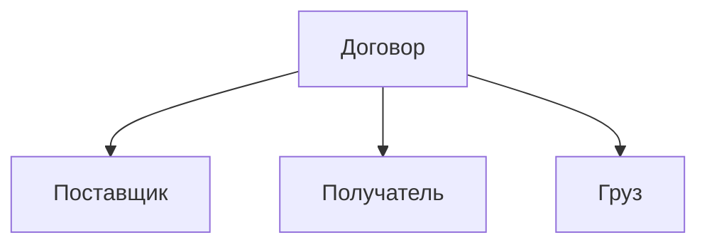
**Рисунок Б.1 $-$ Вариант1 ЛКМ для оперативного документа «Договор …»**

В сущность «Договор» включается общая информация из документа, остальная информация распределяется по остальным сущностям.

Если в задании в «Договоре…» отсутствует информация о <получателе>, то ЛКМ можно представить в виде, изображенном на рисунке Б.3.

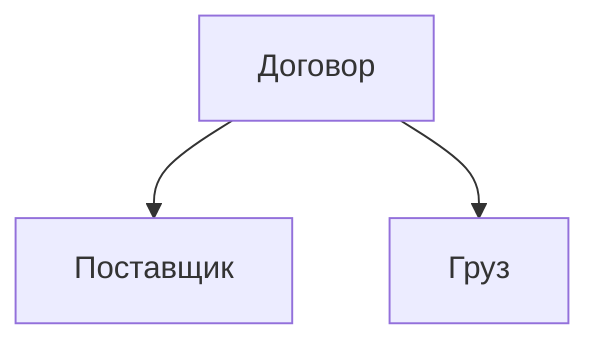
**Рисунок Б.2 $-$ Вариант2 ЛКМ для оперативного документа «Договор …»**

Следует отметить, что в качестве сущности «поставщик» (или другая аналогичная, например, «заказчик» и т.д.) используется сущность, которая определена на основе соответствующего справочного документа.

Пример макета документа представлен на рисунке Б.4.

`Отправитель`
<table>
    <tbody>
       <tr>
            <td>Наименование организации (НаимОрг)</td>
            <td >...</td>
        </tr>
         <tr>
            <td>Адрес организации (АдрОрг)</td>
             <td>...</td>
         <tr>
            <td>ФИО директора (ФИОдир)</td>
            <td>...</td>
        </tr>
    </tbody>
</table>

`Получатель`
<table>
    <tbody>
       <tr>
            <td>Наименование организации (НаимОрг)</td>
            <td >...</td>
        </tr>
         <tr>
            <td>Адрес организации (АдрОрг)</td>
             <td>...</td>
         <tr>
            <td>ФИО директора (ФИОдир)</td>
            <td>...</td>
        </tr>
    </tbody>
</table>

`Перевозчик`
<table>
    <tbody>
       <tr>
            <td>ФИО водителя</td>
            <td >...</td>
        </tr>
         <tr>
            <td>Госномер автомобиля</td>
             <td>...</td>
         </tr>
    </tbody>
</table>

`Общая информация`
<table>
    <tbody>
       <tr>
            <td>Наименование организации (НаимОрг)</td>
            <td >...</td>
        </tr>
         <tr>
            <td>Адрес организации (АдрОрг)</td>
             <td>...</td>
         <tr>
            <td>ФИО директора (ФИОдир)</td>
            <td>...</td>
        </tr>
    </tbody>
</table>

`Получатель`
<table>
    <tbody>
       <tr>
            <td>Наименование организации (НаимОрг)</td>
            <td >...</td>
        </tr>
         <tr>
            <td>Адрес организации (АдрОрг)</td>
             <td>...</td>
         <tr>
            <td>ФИО директора (ФИОдир)</td>
            <td>...</td>
        </tr>
    </tbody>
</table>

`Общая информация`
<table>
    <tbody>
       <tr>
            <td>Общая стоимость поставки продукции (ОбщСтоимПост)</td>
            <td >...</td>
        </tr>
         <tr>
            <td>Дата поставки продукции (ДатаПост)</td>
             <td>...</td>
         </tr>
            <td>Регистрационный номер договора (РегНомДог)</td>
            <td>...</td>
        </tr>
    </tbody>
</table>

`Описание поставляемой продукции`
<table>
<thead>
        <tr>
            <th>№п/п</th>
            <th>Код продукции(КодПр)</th>
            <th>Наименование продукции (НаимПр)</th>
            <th>Количество единиц (КолЕд) </th>
            <th>Стоимость единицы (СтоимЕд) </th>
            <th>Другие</th>
         </tr>
         </thead>
          <tbody>
       <tr>
            <td align="center">...</td>
             <td align="center">...</td>
              <td align="center">...</td>
               <td align="center">...</td>
                <td align="center">...</td>
                 <td align="center">...</td>
        </tr>
    </tbody>
</table>

`Примечание:` Данный документ предназначен для описания поставки (перевозки) продукции (или чего-либо другого) отправителем на склад получателя, на основе ранее заключенного договора.

Назначение сущностей ЛКМ на рисунке Б.5 следующее:
1.	Сущность ТТН $-$ содержит общую информацию из документа ТТН.
2.	Сущность Отправитель $-$ информация об отправителе продукции.
3.	Сущность Получатель $-$ информация о получателе продукции.
4.	Сущность Груз $-$ определяет поставляемую продукцию. Если продукция разнотипная, то возможна декомпозиция данной сущности на совокупность других сущностей, которые определяют разнотипность продукции.
5.	Сущность Перевозчик $-$ информация о водителе, авто и т.д

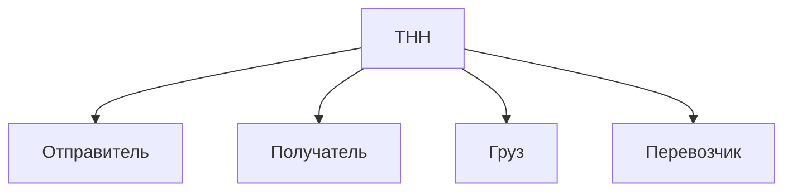

**Рисунок Б.3 $-$ Вариант1 ЛКМ для оперативного документа «ТТН …»**

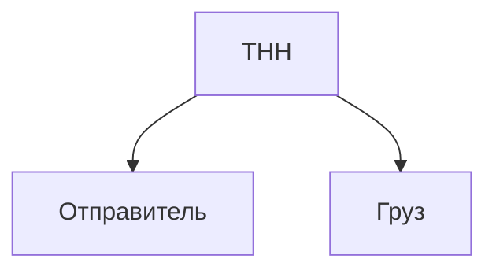
**Рисунок Б.4 – Вариант2  ЛКМ для оперативного документа «ТТН …»**

Данный документ предназначен для описания операций (сдача или получение) с продукцией (материалами, изделиями и т.д.) между складом и подразделением предприятия.  Документы накладная приходная/расходная накладная и накладная на внутреннее перемещение (НВП) будем рассматривать как равнозначные. Пример макета документа приведен на рис.Б.4.

<table>
    <tbody>
       <tr>
            <td>Номер документа</td>
            <td >...</td>
        </tr>
         <tr>
            <td>Дата операции</td>
             <td>...</td>
         <tr>
            <td>Наименование подразделения организации (НаимПодрОрг)</td>
            <td>...</td>
        </tr>
        <tr>
            <td>ФИО получателя (ФИОполуч) или сотрудника</td>
            <td>...</td>
        </tr>
        <tr>
            <td>ФИО кладовщика (ФИОклад)</td>
            <td>...</td>
        </tr>
    </tbody>
</table>

`Описание продукции (или чего-либо)`

<table>
<thead>
        <tr>
            <th>№п/п</th>
            <th>Код продукции(КодПр)</th>
            <th>Наименование продукции (НаимПр)</th>
            <th>Количество единиц (КолЕд) </th>
            <th>Стоимость единицы (СтоимЕд) </th>
            <th>Общая стоимость(ОбщСт)</th>
         </tr>
         </thead>
          <tbody>
       <tr>
            <td align="center">...</td>
             <td align="center">...</td>
              <td align="center">...</td>
               <td align="center">...</td>
                <td align="center">...</td>
                 <td align="center">...</td>
        </tr>
    </tbody>
</table>

**Рисунок Б.6 $-$ Пример макета оперативного документа «Накладная»**

Пример ЛКМ для данного документа приведен на рисунке Б.7, на котором сущности имеют следующее назначение:
1.	Накладная $-$ содержат общую информацию (номер документа, дата операции, операцию, ФИО кладовщика).
2.	Список продукции $-$ содержат информацию о перечне продукции или чего-либо другом.
3.	Сотрудник $-$ содержит информацию о сотруднике, который выполняет операцию.

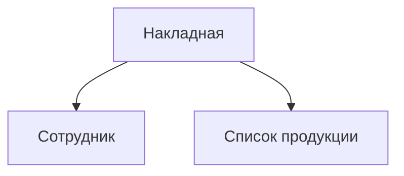
**Рисунок Б.7 $-$ Пример ЛКМ для оперативного документа «Накладная……»**

```ЛКМ для оперативного документа «Карточка складского учета на …»```

**Номер КСУ**

<table>
<thead>
        <tr>
            <th>Номер складского учета (НомСклУч)</th>
            <th>Наименование продукции (НаимПрод)</th>
            <th>Код продукции(КодПрод)</th>
            <th>Сорт продукции(СортПр)</th>
            <th>Стоимость единицы (СтоимЕд) </th>
            <th>Норма запаса(НормЗап)</th>
            <th>Другие</th>
         </tr>
         </thead>
          <tbody>
       <tr>
            <td align="center">...</td>
             <td align="center">...</td>
              <td align="center">...</td>
               <td align="center">...</td>
                <td align="center">...</td>
                 <td align="center">...</td>
                  <td align="center">...</td>
        </tr>
    </tbody>
</table>

**Операции**
<table>
<thead>
        <tr>
            <th>Номер складского учета (НомСклУч)</th>
            <th>Дата операции(ДатОпер)</th>
            <th>Номер документа(НомДок) </th>
            <th>От кого получено /или кому выдано(ФИОсотр)</th>
            <th>Приход(КолПрих)</th>
            <th>Расход(КолРасх)</th>
            <th>Остаток(КолОст)</th>
            <th>Другие</th>
         </tr>
         </thead>
          <tbody>
       <tr>
            <td align="center">...</td>
             <td align="center">...</td>
              <td align="center">...</td>
               <td align="center">...</td>
                <td align="center">...</td>
                 <td align="center">...</td>
                  <td align="center">...</td>
                  <td align="center">...</td>
        </tr>
    </tbody>
</table>

`Примечание:` Данный документ предназначен для ведения (кладовщиком, заведующим складом и т.д.) учета на складе продукции (материалов, изделий и т.д.). Карточка заводится на каждый вид продукции (группу продукции с одинаковыми характеристиками) $-$ номер складского учета. Регистрируются все операции с продукцией на складе (приход продукции на склад, отпуск продукции со склада, списание продукции на складе, переоценка продукции на складе). Операция над продукцией совершается между складом и подразделениями предприятия на основе документа Накладная. Операции списания и переоценки продукции $-$ внутренние операции склада.

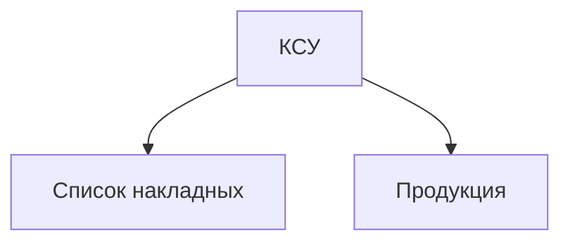
**Рисунок Б.9 $-$ Пример ЛКМ для оперативного документа «КСУ …»**

В приведенном примере на рисунке Б.9 сущности имеют следующее назначение:
1.	Сущность КСУ $-$ содержит следующую информацию: номер документа, инвентарный номер продукции, остаток продукции на складе.
2.	Сущности Список накладных $-$ содержат перечень накладных, которые выполнялись для продукции указанной в КСУ.
3.	Сущность Продукция образована на основе соответствующего справочного документа и содержит общую информацию о продукции (или о чем-либо другом).

`ЛКМ для оперативного документа «Наряд задание …»`

Пример макета документа НЗ приведен на рисунке Б.10.

               Название подразделения предприятия «…»
               Номер наряда-задания (НомНарЗад) «…»
               Номер договора (НомДог)  «…» от дата (ДатЗаклДог) «…»
               Общая стоимость
               Дата начала выполнения
               Дата планируемого окончания


<table>
<thead>
        <tr>
            <th>№ п/п</th>
            <th>Вид работы (ВидРаб)</th>
            <th>Стоимость работы(СтоимРаб) </th>
            <th>Планируемое время выполнения работы(ВремВып)</th>
            <th>Начало выполнения(НачРаб)</th>
            <th>Время завершения (КонРаб)</th>
            <th>...</th>
         </tr>
         </thead>
          <tbody>
       <tr>
            <td align="center">...</td>
             <td align="center">...</td>
              <td align="center">...</td>
               <td align="center">...</td>
                <td align="center">...</td>
                 <td align="center">...</td>
                 <td align="center"></td>
        </tr>
    </tbody>
</table>

`Примечание:` Данный документ предназначен для описания перечня работ, их стоимости и планируемых сроков выполнения. В случае, если при выполнении работы необходимо использовать материалы, комплектующие и т.д., то к наряду дополнительно составляется накладная на их получение на складе предприятия. Предполагается, что наряд-задание формируется на основе заранее заключенного договора на … или другого документа.

**Рисунок Б.10 – Пример макета оперативного документа «НЗ …»**


**Рисунок Б.11 $-$ Вариант1  ЛКМ для оперативного документа «НЗ …»**

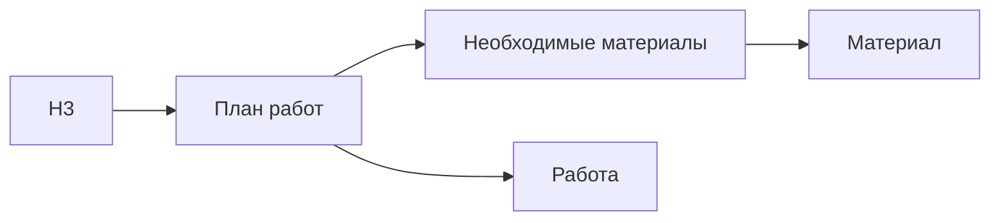

**Рисунок Б.12 $-$ Вариант2  ЛКМ для оперативного документа «НЗ …»**

Приведенные варианты ЛКМ для документа «НЗ» отличаются моделью макета документа НЗ:
1.	Вариант1 $-$ соответствует модели документа, представленному на рисунке Б.10. Назначение сущностей следующее:
    + НЗ $-$ общая информация о НЗ;
	+ План работы $-$ информация, описывающая план выполнения работы;
    + Работа $-$ сущность соответствующая справочному документу Каталог работ или Справочник работ (перечислены виды работ и другие характеристики работ);
2.	Вариант2 $-$ в дополнение к предыдущему варианту в задании для работ определены необходимы мате-риалы, для выполнения этих работ.

`ЛКМ для оперативного документа «Путевой лист …»`

Макет документа ПЛ представлен на рисунке Б.12.

<table>
          <tbody>
       <tr>
            <td>Номер документа ТТН</td>
             <td align="center">...</td>
        </tr>
        <tr>
            <td>ФИО водителя (ФИОвод)</td>
             <td align="center">...</td>
        </tr>
        <tr>
            <td>Государственный номер автомобиля (ГосНомАвто)</td>
             <td align="center">...</td>
        </tr>
        <tr>
            <td>Показатель спидометра до выполнения работы (СпидДоНачРаб)</td>
             <td align="center">...</td>
        </tr>
        <tr>
            <td>Показатель спидометра после выполнения работы (СпидПослеРаб)</td>
             <td align="center">...</td>
        </tr>
        <tr>
            <td>Остаток топлива на начало выполнения работы (ОстТоплДоНач)</td>
             <td align="center">...</td>
        </tr>
        <tr>
            <td>Объем заправки ГСМ (ОбъемЗапр)</td>
             <td align="center">...</td>
        </tr>
        <tr>
            <td>Вид ГСМ (ВидГСМ)</td>
             <td align="center">...</td>
        </tr>
        <tr>
            <td>Остаток топлива после выполнения работы (ОстТоплПослеРаб)</td>
             <td align="center">...</td>
        </tr>
         <tr>
            <td>Вид работы (ВидРаб)</td>
             <td align="center">...</td>
        </tr>
         <tr>
            <td>Начало выполнения работы (НачРаб)</td>
             <td align="center">...</td>
        </tr>
         <tr>
            <td>Окончание выполнения работы (ОкончРаб)</td>
             <td align="center">...</td>
        </tr>
        <tr>
            <td>Длина маршрута (ДлМаршр)</td>
             <td align="center">...</td>
        </tr>
        <tr>
            <td>Вес груза (ВесГр)</td>
             <td align="center">...</td>
        </tr>
        <tr>
             <td>...</td>
             <td></td>
        </tr>
    </tbody>
</table>

**Рисунок Б.12 $-$ Пример макета оперативного документа «ПЛ …»**

Примеры вариантов ЛКМ для документа ПЛ представлены на рисунках Б.13 $-$ Б.15.

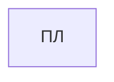
**Рисунок Б.13 $-$ Вариант1 ЛКМ для оперативного документа «ПЛ …»**

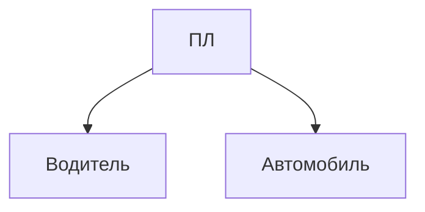

**Рисунок Б.14 $-$ Вариант2  ЛКМ для оперативного документа «ПЛ …»**

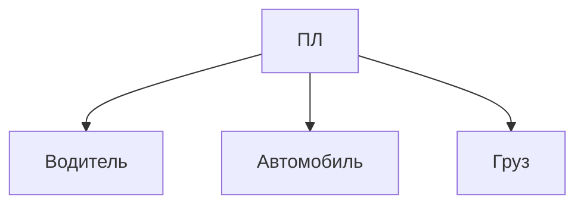

**Рисунок Б.15 $-$ Вариант3 ЛКМ для оперативного документа «ПЛ …»**


Приведенные варианты ЛКМ для документа «ПЛ» отличаются моделью макета документа ПЛ:
1.	Вариант1 $-$ соответствует модели документа, представленному на рисунке Б.12.
2.	Вариант2 $-$ в задании определены справочные документы $-$ Водитель, Автомобили, поэтому в сущности ПЛ будут присутствовать все атрибуты, за исключением атрибутов описывающих Водителя и Автомобиль.
3.	Вариант3 $-$ в задании дополнительно определен справочный документ Груз.

**Оперативный документ «Квитанция на оплату …»**

**Оперативный документ «Журнал учета …»**

**Оперативный документ «График работы …»**

**Оперативный документ «Недельный график работы …»**

**Оперативный документ «План расположения…»**

**Оперативный документ «План работы…»**

**Оперативный документ «Журнал учета …»**


