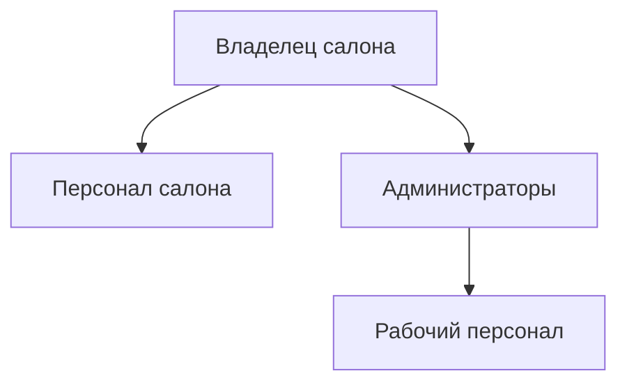
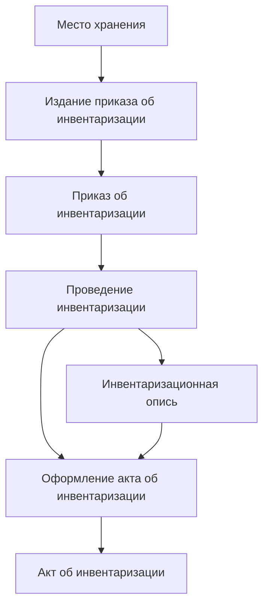

# Лабораторная работа №2 #

## Тема ##

Обследование объекта автоматизации организационная и функциональная структура

## Цель ##

Описать объект автоматизации через организационную и функциональную структуру

## Вариант 7 - Салон красоты ##

|№|Наименование организационной единицы|Расшифровка|
|---|---|---|
|1|Владелец салона|Директор|
|2|Персонал салона|Парикмахеры, Стилисты и т.п.|
|3|Администраторы|Администраторы|
|4|Рабочий персонал|Охранники, Уборщики|

|№|Наименование функции|Организационный элемент|
|---|---|---|
|1|Издание приказа об инвентаризации|Владелец салона, Администраторы|
|2|Место хранения|Рабочий персонал|
|3|Приказ об инвентаризации|Владелец салона, Администраторы|
|4|Проведение инвентаризации|Администраторы|
|5|Инвентаризационная опись|Рабочий персонал|
|6|Оформление акта об инвентаризации|Администраторы|
|7|Акт об инвентаризации|Администраторы|
