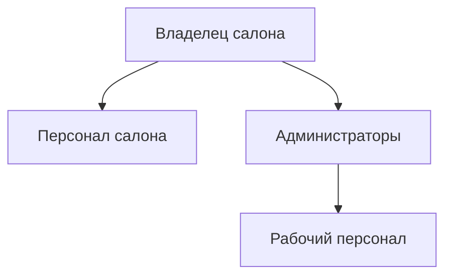
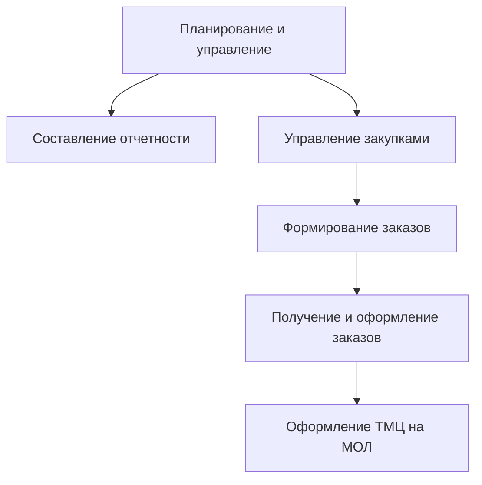

# Лабораторная работа №2 #

## Тема ##

### Обследование объекта автоматизации: организационная структура, функциональная структура ###

## Цель ##

### Описать объект автоматизации через его организационную и функциональную структуру ###

## Вариант 7 - Салон красоты ##

|№ п/п|Наименование организационной единицы|Расшифровка|
|---|---|---|
|1|Владелец салона|Директор|
|2|Персонал салона|Парикмахеры, Мастера маникюра и педикюра, Специалисты по макияжу, Стилисты|
|3|Администраторы|Администраторы|
|4|Рабочий персонал|Охранники, Уборщики|

|№ п/п|Наименование функции|Организационный элемент|
|---|---|---|
|1|Планирование и управление|Директор|
|2|Составление отчетности|Директор, Старший аптекарь|
|3|Управление закупками|Старший аптекарь|
|4|Формирование заказов|Фармацевт|
|5|Получение и оформление заказа|Старший аптекарь|
|6|Оформление ТМЦ на МОЛ|Аптекари|
