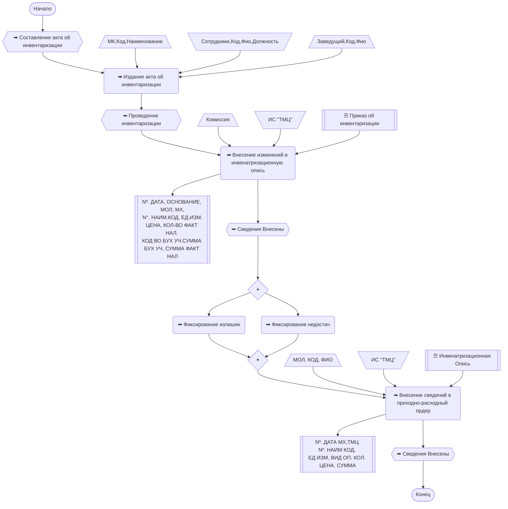

# Лабораторная работа №4 #

## Тема ##

Обследование объекта автоматизации: построение процессной модели.

## Цель ##

Построение процессной модели объекта автоматизации.

## Вариант 7 - Салон красоты ##

### Вывод: в ходе лабораторной работы я научился составлять процессную модель объекта автоматизации ###
