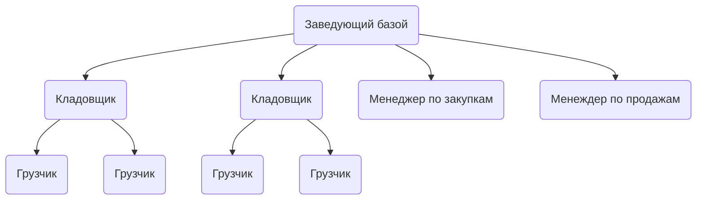
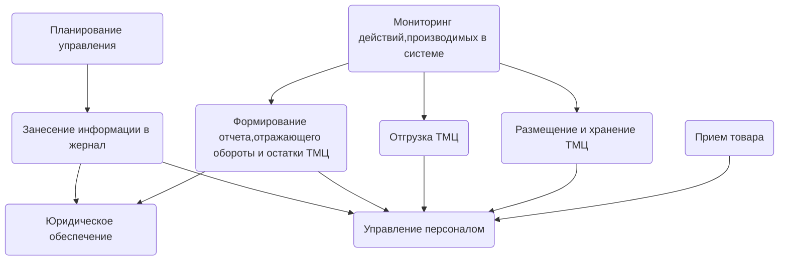

# Лабораторная работа №2 #

## Тема: Организационная, функцианальная структура ##

                                   Вариант 11
                            Реализация оптовой базы

## Организационная структура ##

|№ п/п|Наименование организационной единицы|Расшифрока|
|:----:|:-------------:|:--------:|
|1|Заведующий базой|Руководитель|
|2|Кладовщики|Работник базы|
|3|Грузчики|Работник базы|
|4|Менеджер по закупкам|Работник базы|
|5|Менеджер по продажам|Работник базы|

## Функциональная структура ##

|№ п/п|Наименование функции|Организационный элемент|
|:----:|:-------------:|:--------:|
|1|Приемка товара|Кладовщик|
|2|Занесение информации в журнал|Кладовщик|
|3|Размещение-хранение|Кладовщик|
|4|Отгрузка товара|Кладовщик, Грузчики|
|5|Формирование отчёта оборота и остатков ТМЦ|Руководитель|
