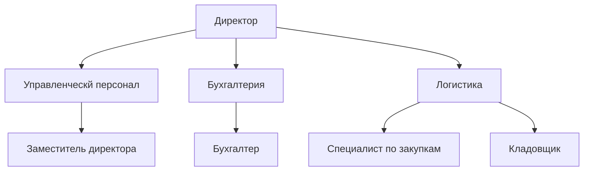
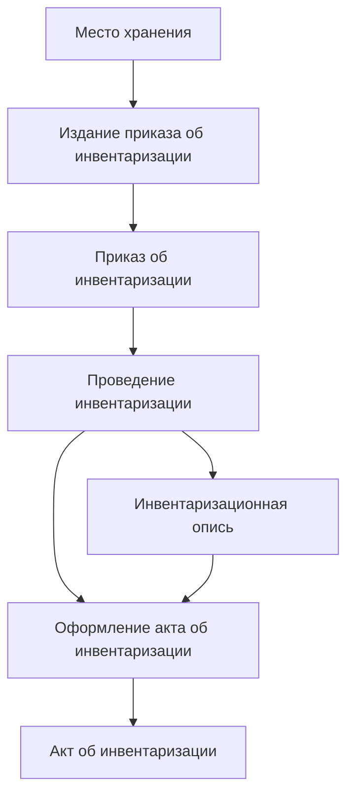

# Лабораторная работа №2 #

## Тема ##

### Организационная, функциональная модель ###

## Цель ##

### Ознакомться с принципами построения организационной и фукциональной модели ###

## Вариант 8 - Оптовая база ##

|№|Наименование организационной единицы|Расшифровка|
|---|---|---|
|1|Директор|Директор|
|2|Управленческий персонал|Заместиель директора|
|3|Бухгалтерия|Бухгалтер|
|4|Логистика|Специалист по закупкам, Кладовщик|

|№|Наименование функции|Организационный элемент|
|---|---|---|
|1|Издание приказа об инвентаризации|Директор, Заместиель директора|
|2|Место хранения|Кладовщик|
|3|Приказ об инвентаризации|Директор, Бухгалтер|
|4|Проведение инвентаризации|Директор, Бухгалтер|
|5|Инвентаризационная опись|Бухгалтер|
|6|Оформление акта об инвентаризации|Кладовщик|
|7|Акт об инвентаризации|Директор|
