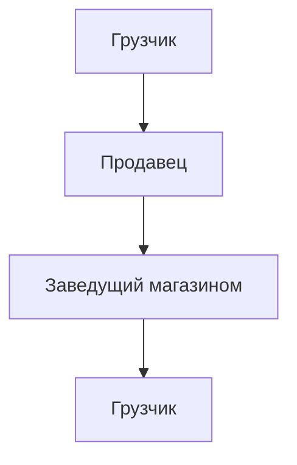
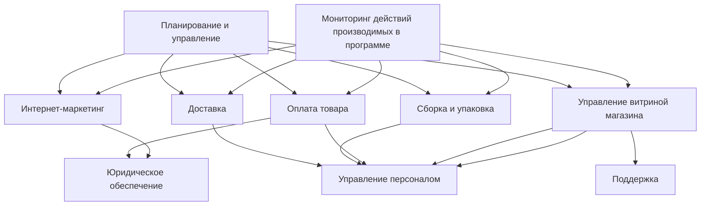

# Лабораторная работа №2 #

## Тема ##

Обследование объекта автоматизации организационная и функциональная структура

## Цель ##

Описать объект автоматизации через организационную и функциональную структуру

## Вариант 12 - Розничный магазин ##

|№|Наименование организационной единицы|Расшифровка|
|---|---|---|
|1|Розничный магазин|Магазин|
|2|Заведующий магазином|Руководитель|

|№|Наименование функции|Организационный элемент|
|---|---|---|
|1|Получение товара|Кладовщик,продавец|
|2|Размещение и пересчет|Кладовщик,продавец|
|3|Коррекция информации|Заведующий|