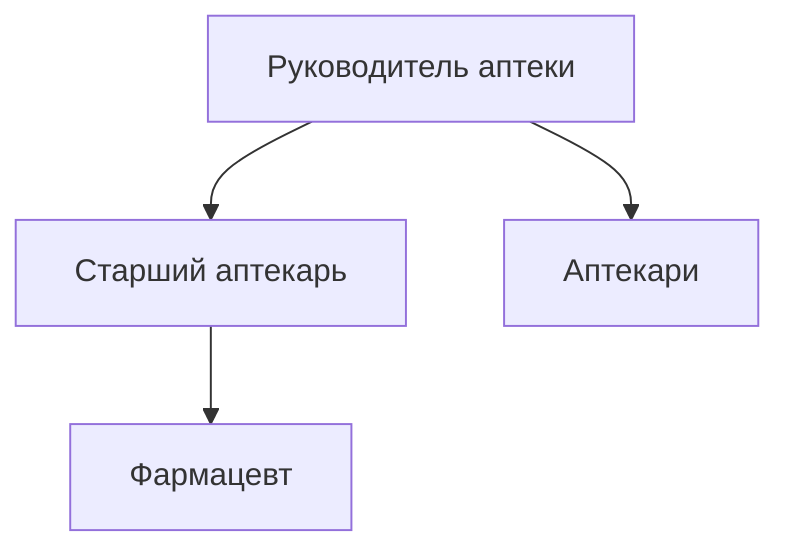
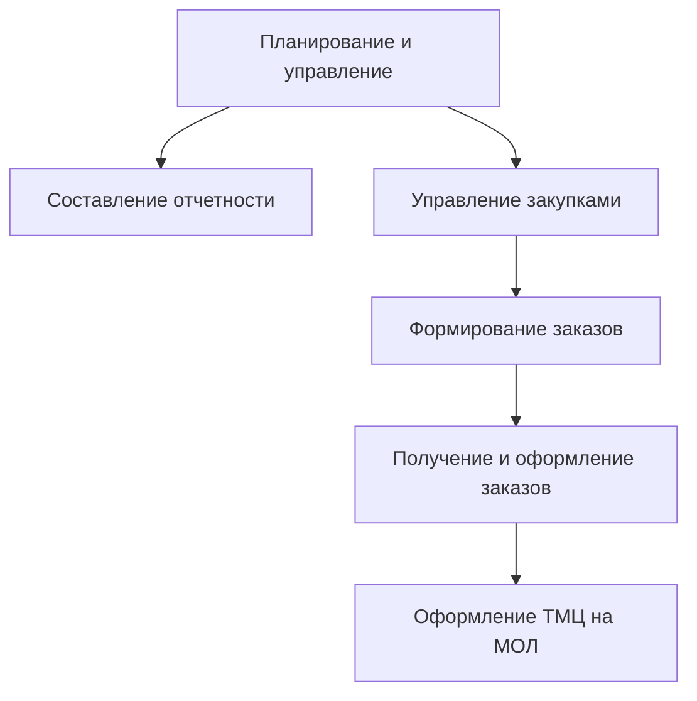

# Лабораторная работа №2 #

## Тема ##

### Обследование объекта автоматизации: организационная структура, функциональная структура ###

## Цель ##

### Описать объект автоматизации через его организационную и функциональную структуру ###

## Вариант 13 - Аптека ##

|№ п/п|Наименование организационной единицы|Расшифровка|
|---|---|---|
|1|Руководитель аптеки|Директор|
|2|Старший аптекарь|Старший аптекарь|
|3|Фармацевт|Фармацевт|
|4|Аптекари|Аптекари|

|№ п/п|Наименование функции|Организационный элемент|
|---|---|---|
|1|Планирование и управление|Директор|
|2|Составление отчетности|Директор, Старший аптекарь|
|3|Управление закупками|Старший аптекарь|
|4|Формирование заказов|Фармацевт|
|5|Получение и оформление заказа|Старший аптекарь|
|6|Оформление ТМЦ на МОЛ|Аптекари|
