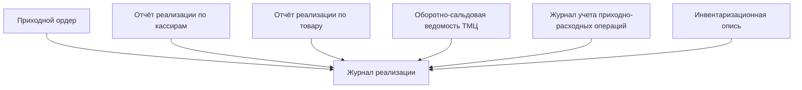

# Лабораторная работа №3 #

## Тема ##

### Обследование объекта автоматизации: построение информационной модели ###

## Цель ##

### Построение информационной модели объекта автоматизации ###

## Вариант 13 - Аптека ##

|Атрибут|Назначения|Тип данных|Источниик данных|
|-|-|-|-|
|1|2|3|4|
|Количество|Количество товара|Число|-|
|Код|Код товара|Число|-|
|Производитель|Производитель товара|Строка|-|
|Поставщик|Поставщик товара|Строка|-|
|Составитель|Человек ответственный за документ|Строка|-|
|Единица|Тип единицы товара|Строка|-|
|Стоимость|Стоимость товара|Число|-|

### Вывод: в ходе лабораторной работы я научился составлять информационную модель объекта автоматизации ###
 