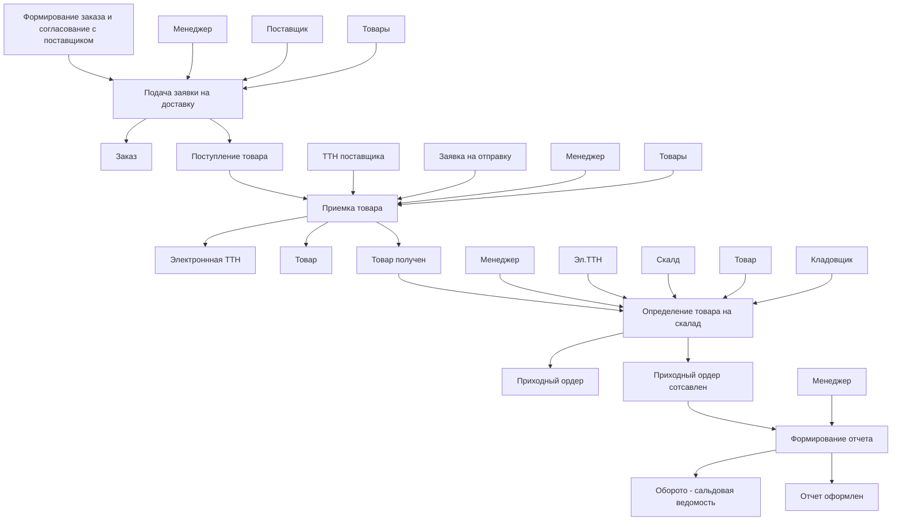

# Лабораторная работа №4 #

## Тема ##

### Обследование объекта автоматизации: построение информационной модели ###

## Цель ##

### Изучить и построить процессную модель объекта автоматизации ###

## Вариант 1 - Аптека ##

