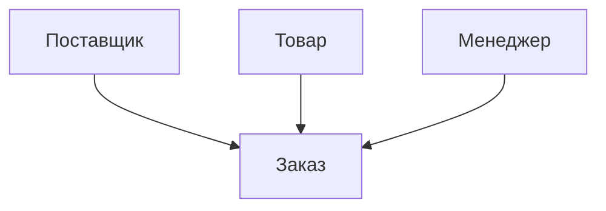
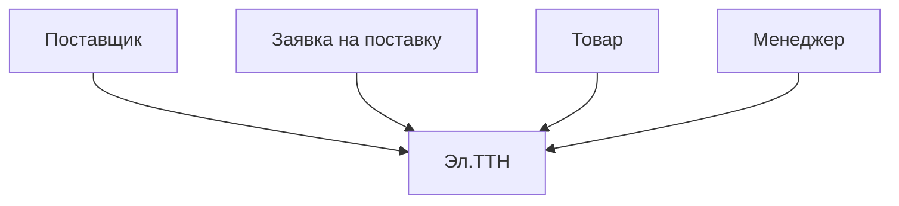
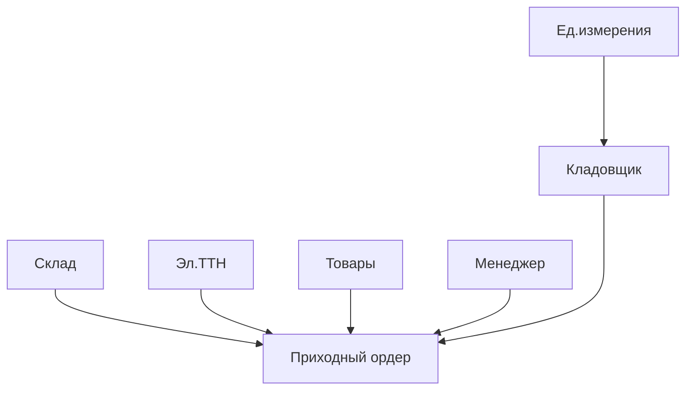
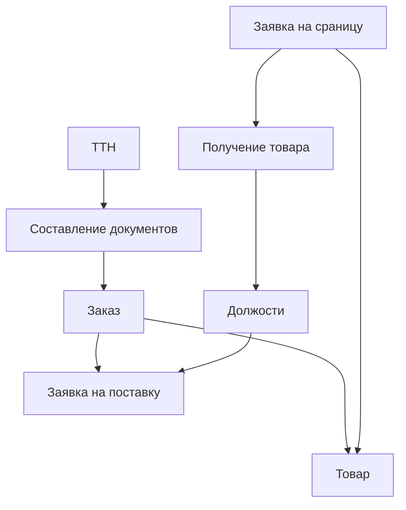

# Лабораторная работа №5 #

## Тема ##

### Объединение локальных кунцептуальных моделей в КМ БД ОА ###

## Цель ##

### Построить концептуальную модель базы данных ###

## Вариант 1 - Аптека ##

### Локальная концептуальная модель 1 ###

|Связь|Тип|Множественность|
|-|-|-|
|Заказ - Поставщик|Слабый - сильный|Один к многому|
|Заказ "Менеджер"|Слабый - сильный|Один к многому|
|Заказ - Товар|Слабый - сильный|Один к многому|

### Локальная концептуальная модель 2 ###

|Связь|Тип|Множественность|
|-|-|-|
|ТТН - Поставщик|Слабый - сильный|Один к многому|
|ТТН - Заявка на поставку|Слабый - слабый|Один к одному|
|ТТН - Товар|Слабый - сильный|Один к многому|
|ТТН - Менеджер|Слабый - сильный|Один к многому|

### Локальная концептуальная модель 3 ###

|Связь|Тип|Множественность|
|-|-|-|
|Приходный ордер - Склад|Слабый - сильный|Один к многому|
|Приходный ордер - ТТН|Слабый - слабый|Один к одному|
|Приходный ордер - Менеджер|Слабый - сильный|Один к многому|
|Приходный ордер - Кладовщик|Слабый - сильный|Один к многому|
|Приходный ордер - Товар|Слабый - сильный|Один к многому|
|Товар - Единицы измерения|Слабый - сильный|Один к многому|

|Связь|Тип|Множественность|
|-|-|-|
|Заказ - Поставщик|Слабый - сильный|Один к многому|
|Заказ - "Менеджер"|Слабый - слабый|Один к одному|
|Заказ - Товар|Слабый - сильный|Один к многому|
|ТТН - Поставщик|Слабый - сильный|Один к многому|
|ТТН - Заявка на поставку|Слабый - сильный|Один к многому|
|ТТН - Товар|Слабый - сильный|Один к многому|
|ТТН - Менеджер|Слабый - сильный|Один к многому|
|Приходный ордер - склад|Слабый - сильный|Один к многому|
|Приходный ордер - ТТН|Слабый - сильный|Один к многому|
|Приходный ордер - Менеджер|Слабый - сильный|Один к многому|
|Приходный ордер - Кладовщик|Слабый - сильный|Один к многому|
|Приходный ордер - товар|Слабый - сильный|Один к многому|
|Товар - единицы измерения|Слабый - сильный|Один к многому|
