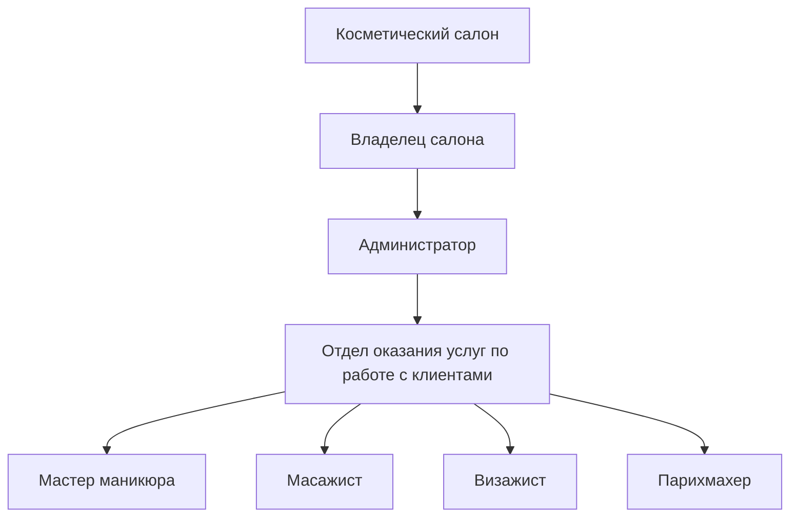
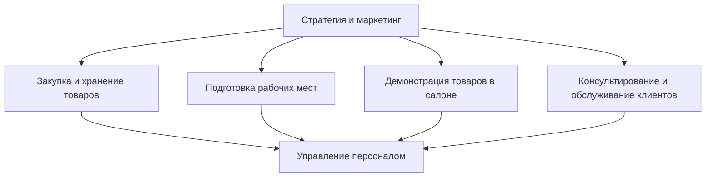

# Лабораторная работа №2 

## Тема 

Обследование объекта автоматизации организационная и функциональная структура

## Цель 

Описать объект автоматизации через организационную и функциональную структуру

## Вариант 10 - Косметический салон

|№|Наименование организационной единицы|Расшифровка|
|---|---|---|
|1|Косметический салон|Предприятие|
|2|Владелец салона|Руководитель отделения|
|3|Администратор|Помощник руководителя|
|4|Отдел оказания услуг по работе с клиентами|Отделение|
|5|Мастер маникюра|Персонал|
|6|Масажист|Персонал|
|7|Визажист|Персонал|
|8|Парихмахер|Персонал|

|№|Основные процессы|Организационный элемент|
|---|---|---|
|1|Управление персоналом|Владелец салона|
|2|Закупка и хранение товаров|Администратор салона|
|3|Подготовка рабочих мест|Мастера салона, уборщицы|
|4|Демонстрация товаров в салоне|Администратор, мастера салона|
|5|Консультирование и обслуживание клиентов|Администратор, мастера салона|